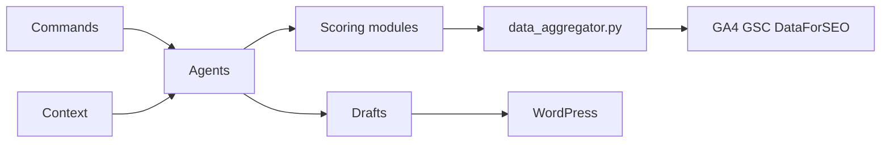

# TheCraigHewitt/seomachine

> Espace de travail Claude Code avec commandes, agents et skills pour produire du contenu SEO.

## Le problème
Rechercher, rédiger, optimiser et publier des articles SEO à la main prend des heures par article.

## Ce que ça fait vraiment
Des commandes `.claude/commands` (`/research`, `/write`, `/optimize`, `/rewrite`, `/publish-draft`…) qui enchaînent des agents spécialisés.
Des modules Python d'analyse : intention de recherche, densité de mots-clés (TF-IDF, K-means), lisibilité, score SEO.
Des intégrations GA4, Search Console et DataForSEO ; publication WordPress avec Yoast.
Des fichiers de contexte (ton de la marque, mots-clés) qui guident tout.

## Comment c'est branché


## Essayer
```bash
git clone https://github.com/TheCraigHewitt/seomachine.git
cd seomachine
pip install -r data_sources/requirements.txt
```

## Coût et pièges
Compte Anthropic, abonnement DataForSEO et accès Google Analytics à ta charge. Les fichiers de contexte doivent être remplis avant tout usage.

## Ce que ce n'est pas
Pas une application : c'est un ensemble de prompts et de scripts à utiliser dans Claude Code.

## Alternatives
Aucune alternative nommée dans le README.

## Pour toi
À surveiller : le métier SEO t'est étranger, mais c'est un bon exemple d'organisation de commandes, agents et skills Claude Code dont tu peux reprendre la structure.
