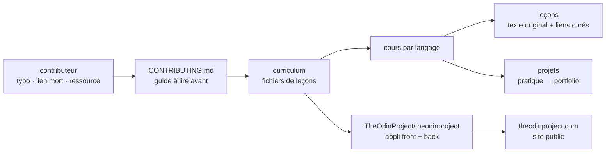

# TheOdinProject/curriculum

> **The lesson files behind The Odin Project's full-stack web curriculum — to read or to fix, not to install.**

## The problem

Learning web development alone means stacking tutorials with no order and no thread: you never
know what to read next, or when you have practised enough to move on. The README states the
opposite arrangement: courses split by language, lessons interspersed with projects, and
finished projects that feed a portfolio. Without that frame, the path stays a pile of links
with no progression and no evidence of what you can actually build.

## What it actually does

This repository holds **the teaching material only**: the lesson files displayed on
theodinproject.com. The README says so plainly — the application that renders them, with its
front-end and back-end, lives in a separate repository, `TheOdinProject/theodinproject`.

Per the README, the content is two things: original writing produced by the project, and a
compilation of web resources curated one by one. That is exactly where contribution starts,
which is the repository's reason to exist: the README lists what you can do — fix typos and
grammar, rewrite unclear passages, repair broken links, add resource links, and write entirely
new lessons *after getting approval*.

The stated structure is course → lessons → projects, each course covering its language "in
depth". The README gives neither the list of courses, nor the file format, nor the publishing
chain: all of that sits outside what it documents. The community is pointed to a Discord server.

## How it is wired



No code-derived diagram exists for this repository: the chart above is reconstructed from the
README alone, so it names only the two files the README cites (`CONTRIBUTING.md`, `license.md`)
and the content / application split. The arrow that matters is the one on the right: the repo
is not the product, it is the data source of another repo.

## Try it

No install or run command is documented in the README — consistent with a content repository.
The only entry points it gives are addresses:

```
https://www.theodinproject.com/                                        # the curriculum online
https://github.com/TheOdinProject/curriculum/blob/main/CONTRIBUTING.md # read before contributing
https://github.com/TheOdinProject/theodinproject                       # the application
https://discord.gg/fbFCkYabZB                                          # the community
```

To read the lessons you go through the website; to change them, through the contributing guide.
Nothing to install locally according to the README.

## Cost and pitfalls

- **Licence to check**: the catalogue records `NOASSERTION`, meaning GitHub could not identify
  the file. The README points to a `license.md` "for usage details" without naming the licence.
  For teaching material, reuse terms (translation, internal reuse, training) are precisely what
  you need to know: resolve it on that file before any use beyond reading.
- **The repo does not render itself**: without the `theodinproject` application you have lesson
  files, not a navigable curriculum. The cost of any off-site use is undocumented.
- **Contributing is not self-service**: the README makes new lessons conditional on prior
  approval, and points to a contributing guide to be read thoroughly.
- **The real cost is learning time**, not infrastructure: nothing to install, nothing to pay,
  but a full full-stack web curriculum to work through.
- **Thin README**: no course list, no volume figures, no update cadence.

## What it is not

- **It is not the Odin Project site or app.** The README says it outright: front-end and
  back-end live in `TheOdinProject/theodinproject`. Cloning this repo does not give you a
  platform.
- **It is not code to run**: it is lesson content. The `JavaScript` language tag from the
  catalogue describes the subject taught, not a library you would import.
- **It is not a link list**: the README distinguishes original writing from curated external
  resources. Both coexist.
- **It is not a certified or tutored programme**: the README mentions no tutor, no assessment
  and no credential — only projects you build and put in a portfolio, plus a Discord.
- **It is not aimed at data, AI or MLOps**: the subject is full-stack web development.

## Alternatives

| | When to prefer it |
|---|---|
| **microsoft/Web-Dev-For-Beginners** | Catalogue neighbour, and the only genuinely comparable one: also a web curriculum for beginners. Prefer it for a shorter, bounded programme; The Odin Project aims at a complete full-stack path with portfolio projects. |
| **Asabeneh/30-Days-Of-JavaScript** | Catalogue neighbour: a focused single-language challenge over thirty days. Prefer it to close a specific JavaScript gap rather than to follow a whole curriculum. |

The two remaining neighbours are not comparable: `haizlin/fe-interview` is a front-end interview
question bank, not a curriculum, and `HabitRPG/habitica` is a habit-tracking application — since
neighbours are computed lexically, the proximity there is thematic ("web", "JavaScript") rather
than functional.

## For you

Watch rather than adopt: for a data / AI / MLOps profile the content itself is off-topic — web
development, not models or pipelines. The interest lies elsewhere, and it is real: this is a
mature example of a strict split between versioned content and the application that renders it,
with a contributing guide that holds a community together at scale. That model transfers to
internal documentation or an onboarding curriculum. Open it as an organisational reference, not
as a dependency nor as a source of domain training.
