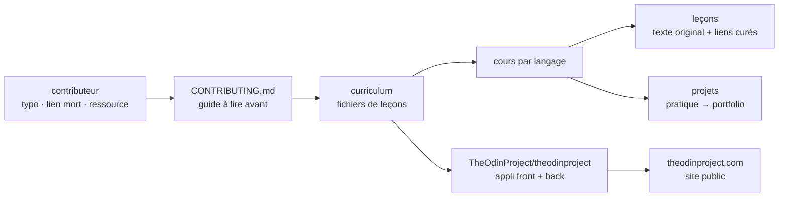

# TheOdinProject/curriculum

> **Les fichiers de leçons du cursus web full-stack The Odin Project, à lire ou à corriger, pas à installer.**

## Le problème

Apprendre le développement web seul revient à empiler des tutoriels sans ordre ni fil : on ne
sait pas quoi lire ensuite, ni quand on a assez pratiqué pour passer à la suite. Le README pose
l'inverse : des cours découpés par langage, des leçons entrecoupées de projets, et des projets
terminés qui alimentent un portfolio. Sans ce cadre, le parcours reste une collection de liens
sans progression ni preuve de ce qu'on sait faire.

## Ce que ça fait vraiment

Ce dépôt ne contient **que la matière pédagogique** : les fichiers de leçons affichés sur
theodinproject.com. Le README le dit explicitement — l'application qui les rend, avec son
front-end et son back-end, vit dans un autre dépôt, `TheOdinProject/theodinproject`.

Le contenu se compose de deux choses selon le README : du texte original écrit par le projet,
et une compilation de ressources du web sélectionnées une à une. C'est précisément le point
d'entrée de la contribution, qui est la raison d'être du dépôt : le README liste ce qu'on peut
y faire — corriger fautes et grammaire, réécrire des passages peu clairs, réparer des liens
morts, ajouter des ressources, et écrire de nouvelles leçons *après accord préalable*.

L'organisation annoncée est cours → leçons → projets, chaque cours traitant son langage « en
profondeur ». Le README ne donne ni la liste des cours, ni le format des fichiers, ni la chaîne
de publication : tout cela est hors de ce qu'il documente. La communauté est renvoyée vers un
serveur Discord.

## Comment c'est branché



Aucun diagramme tiré du code n'existe pour ce dépôt : ce schéma est reconstruit depuis le seul
README, et ne nomme donc que les deux fichiers qu'il cite (`CONTRIBUTING.md`, `license.md`) et
la séparation contenu / application. La flèche qui compte est celle de droite : le dépôt n'est
pas le produit, il est la source de données d'un autre dépôt.

## Essayer

Aucune commande d'installation ou de lancement n'est documentée dans le README — c'est cohérent
avec un dépôt de contenu. Les seuls points d'entrée qu'il donne sont des adresses :

```
https://www.theodinproject.com/                                        # le cursus en ligne
https://github.com/TheOdinProject/curriculum/blob/main/CONTRIBUTING.md # à lire avant de contribuer
https://github.com/TheOdinProject/theodinproject                       # l'application
https://discord.gg/fbFCkYabZB                                          # la communauté
```

Pour lire les leçons, on passe par le site ; pour les modifier, par le guide de contribution.
Rien à installer localement selon le README.

## Coût et pièges

- **Licence à vérifier** : le catalogue relève `NOASSERTION`, c'est-à-dire que GitHub n'a pas su
  identifier le fichier. Le README renvoie à un `license.md` « pour les détails d'usage » sans en
  citer le nom. Pour du contenu pédagogique, les conditions de réutilisation (traduction,
  reprise interne, formation) sont exactement ce qu'on a besoin de savoir : à lever sur le
  fichier avant tout usage autre que la lecture.
- **Le dépôt seul ne se rend pas** : sans l'application `theodinproject`, on a des fichiers de
  leçons, pas un cursus navigable. Le coût d'un usage hors site n'est pas documenté.
- **Contribuer n'est pas libre-service** : le README conditionne les nouvelles leçons à un accord
  préalable, et renvoie à un guide de contribution « à lire entièrement ».
- **Le vrai coût est le temps d'apprentissage**, pas l'infrastructure : rien à installer, rien à
  payer, mais un cursus complet de développement web full-stack à parcourir.
- **Matière du README limitée** : ni liste des cours, ni volumétrie, ni rythme de mise à jour.

## Ce que ce n'est pas

- **Ce n'est pas le site ni l'application The Odin Project.** Le README l'écrit noir sur blanc :
  le front-end et le back-end sont dans `TheOdinProject/theodinproject`. Cloner ce dépôt-ci ne
  donne pas une plateforme.
- **Ce n'est pas du code à exécuter** : c'est du contenu de leçons. Le langage `JavaScript`
  affiché par le catalogue décrit le sujet enseigné, pas une bibliothèque qu'on importerait.
- **Ce n'est pas une liste de liens** : le README distingue le texte original écrit par le projet
  de la curation de ressources externes. Les deux coexistent.
- **Ce n'est pas un cursus certifiant ni encadré** : le README ne mentionne ni tuteur, ni
  évaluation, ni diplôme — seulement des projets qu'on réalise et qu'on met dans son portfolio,
  et un Discord.
- **Ce n'est pas orienté data, IA ou MLOps** : c'est du développement web full-stack.

## Alternatives

| | Quand le préférer |
|---|---|
| **microsoft/Web-Dev-For-Beginners** | Voisin du catalogue, et le seul réellement comparable : cursus web pour débutants lui aussi. À préférer pour un programme plus court et borné ; The Odin Project vise un parcours full-stack complet avec projets de portfolio. |
| **Asabeneh/30-Days-Of-JavaScript** | Voisin du catalogue : défi ciblé sur un seul langage, sur trente jours. À préférer pour combler une lacune précise en JavaScript plutôt que pour suivre un cursus entier. |

Les deux autres voisins ne sont pas comparables : `haizlin/fe-interview` est une banque de
questions d'entretien front-end, pas un cursus, et `HabitRPG/habitica` est une application de
suivi d'habitudes — les voisins étant calculés par lexique, la proximité y est thématique
(« web », « JavaScript ») et non fonctionnelle.

## Pour toi

À surveiller plutôt qu'à adopter : pour un profil data / IA / MLOps, le contenu lui-même est
hors sujet — du web full-stack, pas de modèles ni de pipelines. L'intérêt est ailleurs, et il
est réel : c'est un exemple abouti de séparation stricte entre le contenu versionné et
l'application qui le rend, avec un guide de contribution qui tient une communauté à l'échelle.
Le modèle est transférable à une documentation interne ou à un cursus d'onboarding. À ouvrir
comme référence d'organisation, pas comme dépendance ni comme source de formation métier.
