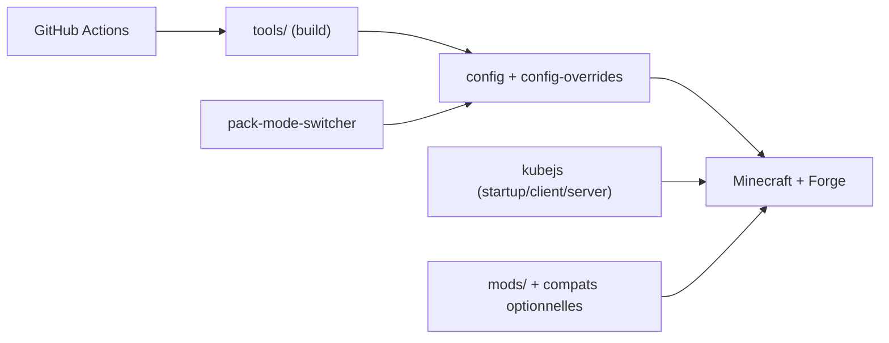

# ThePansmith/Monifactory

> Modpack Minecraft d'automatisation, refonte de Nomifactory CEu, avec modes Normal, Hard et Expert.

## Le problème
Les joueurs de modpacks d'industrie veulent une progression renouvelée après Nomifactory CEu, avec plus de défi.

## Ce que ça fait vraiment
Ajoute de nouveaux multiblocs, mods et une progression UV+, remplace Draconic Evolution et Avaritia par des mécaniques basées sur le Sculk, et retexture l'ensemble. Les modes Hard et Expert durcissent les règles (ère de la vapeur, production d'énergie GregTech obligatoire). D'après le code : scripts KubeJS, configs par mode, outils de build et changement de mode.

## Comment c'est branché


## Essayer
```bash
java -jar ${Server Root}\mods\monilabs-*.jar ${N/H/E}
java -jar TheForgeInstallerName.jar --installServer
unzip server.zip
./run.sh
```

## Coût et pièges
Gratuit ; nécessite Minecraft et un lanceur. Serveur : installeur Forge 47.4.13 et copie manuelle de certains mods. Le changement de mode se fait dans le menu principal depuis la 0.13.

## Ce que ce n'est pas
Ce n'est pas un jeu autonome ni un jeu de données : c'est un pack de mods et de configuration.

## Alternatives
- Nomifactory CEu : le pack dont il est issu.
- GregTech Community Pack : source de certaines quêtes.

## Pour toi
À ignorer : modpack de jeu, sans rapport avec un travail data/IA/MLOps.

