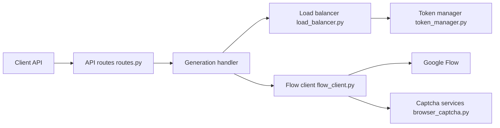

# TheSmallHanCat/flow2api

> Passerelle exposant la génération d'images et vidéos de Google Flow via des API compatibles OpenAI et Gemini.

## Le problème
Flow (génération d'images et de vidéos Veo/Imagen) n'offre pas d'API standard ; on veut l'appeler comme un endpoint OpenAI.

## Ce que ça fait vraiment
Le service normalise les requêtes, choisit un compte (jeton) par répartition de charge, soumet la tâche à Flow et renvoie le média ou la progression en flux. Il rafraîchit les jetons, gère proxys, limites de concurrence et résolution de captcha (services tiers ou navigateur). Il fournit une interface d'administration, une page de test et des métriques Prometheus.

## Comment c'est branché


## Essayer
```bash
git clone https://github.com/TheSmallHanCat/flow2api.git
cd flow2api
docker-compose up -d
docker-compose logs -f
```
Administration sur `http://localhost:8000` (identifiants par défaut `admin` / `admin`, à changer de suite).

## Coût et pièges
Il faut des comptes et jetons Flow, et un service de captcha payant (YesCaptcha, etc.) ou un navigateur. Le service contourne des contrôles anti-automatisation et utilise un accès non officiel : cela peut enfreindre les conditions d'utilisation de Google et provoquer la suspension des comptes. À n'utiliser que sur ses propres comptes, dans le cadre légal.

## Ce que ce n'est pas
Pas une API officielle de Google : il dépend d'un protocole amont susceptible de changer (le README suit les mises à jour de requêtes). Le dépôt affiche un sponsor commercial.

## Alternatives
- APIMart (sponsor cité dans le README) : API payante d'images et vidéos, sans passerelle non officielle.

## Pour toi
À ignorer en production : accès non officiel à un SaaS, risque de conformité et de coupure ; préférer une API officielle avec clé et contrat.

