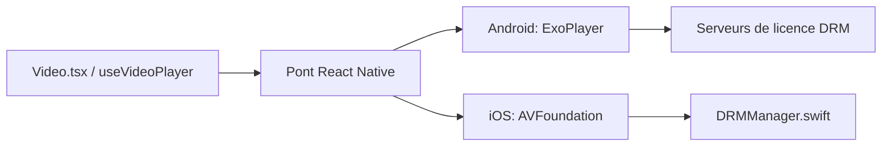

# TheWidlarzGroup/react-native-video

> Composant lecteur vidéo pour React Native : HLS/DASH, DRM, lecture hors ligne.

## Le problème
Lire des vidéos en streaming avec DRM sur iOS et Android depuis React Native demande du natif sur mesure.

## Ce que ça fait vraiment
Fournit `useVideoPlayer` et `VideoView`, lit HLS, DASH et SmoothStreaming, gère Widevine/FairPlay, Picture-in-Picture, plugin Expo. La v7 (bêta) repose sur `react-native-nitro-modules` et la nouvelle architecture RN. Le code décrit ExoPlayer (Android), AVFoundation (iOS).

## Comment c'est branché


## Essayer
```bash
npm install react-native-nitro-modules
npm install react-native-video@beta
cd ios && pod install
```

## Coût et pièges
Gratuit ; l'éditeur vend du support, un SDK hors ligne et des boilerplates. La v7 change souvent ; TV et VisionOS non faits.

## Ce que ce n'est pas
Pas un service de streaming : il ne fournit ni hébergement ni serveur de licences.

## Alternatives
Aucune alternative nommée dans le README.

## Pour toi
Ignorer : composant mobile hors du périmètre data/IA/MLOps.

