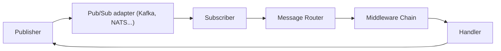

# ThreeDotsLabs/watermill

> Bibliothèque Go pour flux de messages et applications pilotées par événements, au-dessus de Kafka, RabbitMQ, NATS et autres.

## Le problème
Construire des services pilotés par événements exige de connaître beaucoup de détails de livraison, d'ordre et de reprise.

## Ce que ça fait vraiment
Elle expose un handler `func(*Message) ([]*Message, error)`, des interfaces `Publisher` et `Subscriber`, un routeur avec middlewares (retry, timeout, disjoncteur, déduplication) et des composants (CQRS, délai, forwarder, métriques, requête/réponse, requeuer). Chaque broker (AMQP, Kafka, NATS, Redis Streams, SQL, SQLite, Google Cloud, AWS SNS/SQS, HTTP…) est un paquet séparé. Les tests de chaque implémentation tournent 20 fois en parallèle avec détection de courses.

## Comment c'est branché

## Essayer
Aucune commande documentée dans le README : il renvoie vers le Quickstart, le guide de démarrage et les exemples.

## Coût et pièges
Gratuit. Le débit varie beaucoup selon le broker : de 315 776 messages/s publiés (GoChannel) à 2 770 (AMQP), sur une VM de 16 CPU, mesures du projet à prendre comme ordre de grandeur.

## Ce que ce n'est pas
Pas un broker : il en abstrait. Pas un outil pour Python : c'est du Go.

## Alternatives
Aucune alternative nommée dans le README (une liste « Awesome Watermill » recense des bibliothèques non officielles).

## Pour toi
À ignorer sauf si tu écris des services événementiels en Go : sans rapport direct avec un travail data/IA en Python.

