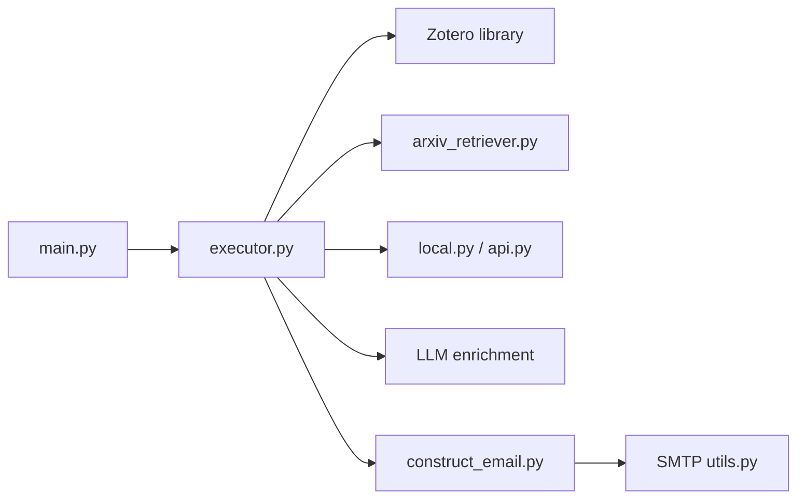

# TideDra/zotero-arxiv-daily

> Envoie chaque jour par e-mail les nouveaux preprints proches de ta bibliothèque Zotero.

## Le problème
Des dizaines de preprints arXiv paraissent chaque jour ; trier à la main ce qui touche à tes lectures prend du temps.

## Ce que ça fait vraiment
Récupère ta bibliothèque Zotero et les articles de la veille (arXiv, bioRxiv, medRxiv, chemRxiv), calcule des embeddings des résumés (modèle local ou API) et classe par similarité pondérée, les ajouts récents pesant plus. Un LLM génère un TL;DR à partir du PDF, avec affiliations et liens PDF/code. Le résumé part par SMTP.

## Comment c'est branché


## Essayer
```bash
cd zotero-arxiv-daily
uv run main.py
# ou : fork + secrets GitHub (ZOTERO_ID, ZOTERO_KEY, SENDER, RECEIVER, OPENAI_API_KEY…)
```

## Coût et pièges
Gratuit via GitHub Actions pour un dépôt public. Il faut une clé Zotero, un compte SMTP et une clé LLM (SiliconFlow propose des modèles gratuits selon le README). Le temps d'exécution limite le nombre d'articles (6 h par exécution).

## Ce que ce n'est pas
L'algorithme de recommandation est simple, le README l'admet. Pas un outil de lecture ni d'annotation.

## Alternatives
Aucune alternative nommée dans le README.

## Pour toi
Adopter : une veille papiers quotidienne cadrée sur ton Zotero, forkable sans installation ; l'AGPL gêne seulement si tu redistribues un service dérivé.

