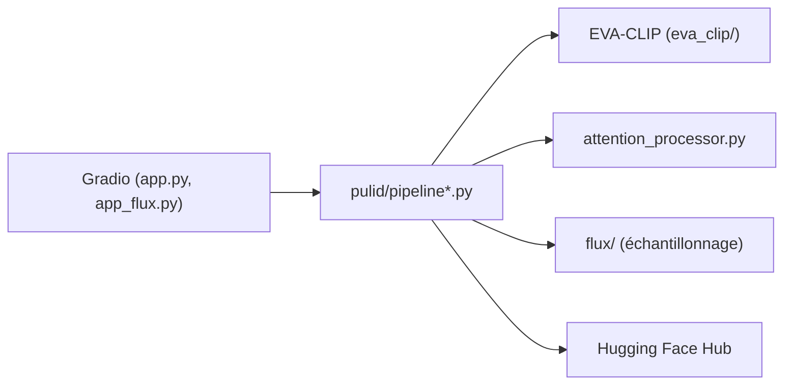

# ToTheBeginning/PuLID

> Méthode de personnalisation d'identité pour SDXL et FLUX, qui conserve un visage à partir d'une photo.

## Le problème
Générer des images d'une personne précise sans dégrader le style ni la fidélité du visage, et sans réglage long.

## Ce que ça fait vraiment
Encode une image de référence (EVA-CLIP), aligne les caractéristiques par apprentissage contrastif et les injecte dans le modèle de diffusion via des processeurs d'attention. Versions PuLID-v1 et v1.1 (SDXL) et PuLID-FLUX v0.9.0/v0.9.1. Démos Gradio locales et en ligne.

## Comment c'est branché


## Essayer
```bash
git clone https://github.com/ToTheBeginning/PuLID.git
cd PuLID
conda create --name pulid python=3.10
conda activate pulid
pip install -r requirements.txt
python app.py
```

## Coût et pièges
GPU requis ; PyTorch ≥ 2.4.1 et `requirements_fp8.txt` pour FLUX sur GPU grand public. Dernier push en juillet 2025 (plus d'un an).

## Ce que ce n'est pas
La personnalisation de visage expose à l'usurpation d'identité : le README rappelle l'usage responsable et décline toute responsabilité. Les auteurs annoncent DreamO comme successeur.

## Alternatives
- DreamO : cadre unifié (identité, IP, essayage, style) mis en avant par les auteurs.
- PuLID_ComfyUI (cubiq) : implémentation native ComfyUI.

## Pour toi
À surveiller : utile pour comprendre la personnalisation d'identité, mais les auteurs orientent déjà vers DreamO.

