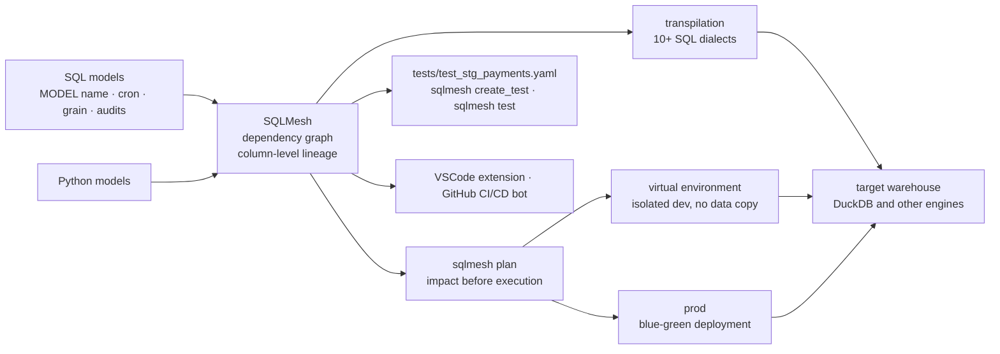

# TobikoData/sqlmesh

> **A data transformation framework for SQL or Python models, with virtual dev environments and a plan/apply workflow.**

## The problem

Changing a transformation in a warehouse is done blind: you do not know which downstream
models break, how many tables will be rebuilt, or what the bill will look like. Building a
test environment usually means copying data, so paying twice, and unit testing needs a
separate toolchain bolted on.

## What it actually does

SQLMesh reads models defined in SQL (or Python) and derives the dependency graph from them,
including **column-level lineage**. A model is declared with a `MODEL (...)` block carrying
its `name`, `cron`, `grain` and `audits` — the README's example is `tcloud_demo.stg_payments`
with `UNIQUE_VALUES` and `NOT_NULL` audits — without a `Jinja` + `YAML` layer on top.

The workflow is Terraform's: `plan` shows the impact of a change before running it, `apply`
carries it out. Virtual data environments give an isolated development environment without
copying warehouse data, which enables blue-green deployments and a `data diff` between prod
and dev limited to the tables a change touches.

SQLMesh tracks what has already been computed and builds a table only once, re-running only
the partitions needed for incremental models. It transpiles SQL written in one dialect into
the target warehouse's dialect on the fly and surfaces transformation errors before they are
sent, across 10+ execution engines.

Finally, `sqlmesh create_test` generates a YAML unit-test file from a live query, and
`sqlmesh test` replays it locally. A VSCode extension and a GitHub CI/CD bot sit alongside
the CLI.

## How it is wired



No code-derived diagram exists for this repository: the graph above is reconstructed from the
README alone, which otherwise points to an architecture image
(`docs/readme/architecture_diagram.png`) not readable here.

## Trying it

```bash
mkdir sqlmesh-example
cd sqlmesh-example
python -m venv .venv
source .venv/bin/activate
pip install 'sqlmesh[lsp]' # install the sqlmesh package with extensions to work with VSCode
source .venv/bin/activate # reactivate the venv to ensure you're using the right installation
sqlmesh init # follow the prompts to get started (choose DuckDB)
```

Then, for unit tests (README commands):

```bash
sqlmesh create_test tcloud_demo.stg_payments --query tcloud_demo.seed_raw_payments "select * from tcloud_demo.seed_raw_payments limit 5"

# run the unit test
sqlmesh test
```

On Windows the README swaps activation for `.\.venv\Scripts\Activate.ps1`, and notes you may
need `python3` / `pip3`.

## Cost and gotchas

- **Free, no API key**: install with `pip`, no account to create to get started. The README
  documents no quota, no telemetry and no crippled free tier.
- **The real cost is the warehouse**: SQLMesh computes nothing itself, it drives an engine
  (DuckDB locally for the tutorial, a metered warehouse in practice). Its pitch is precisely
  to shrink that bill by not rebuilding twice; the queries are still yours to pay for.
- **`sqlmesh create_test` runs a live query** against the warehouse to produce the expected
  output — not free on a metered engine.
- **The `[lsp]` extra** is needed for the VSCode extension, and the README insists on
  reactivating the venv after installing, a sign of a common path trap.
- **Licence**: the README states Apache 2.0 for the code and CC-BY-4.0 for the docs, but the
  batch metadata records no licence. Intent is clear, automated verification is missing —
  hence the alert, to be cleared against the repository's `LICENSE`.
- **Contributing** requires a DCO sign-off (`CONTRIBUTING.md`).

## What it is not

- **Not a warehouse or a query engine**: no storage, no compute. It generates and schedules
  SQL for an engine you supply and pay for separately.
- **Not a general-purpose orchestrator**: the `cron` lives inside the model definition, and
  the scope is data transformation, not arbitrary pipelines.
- **Not a one-person project, nor purely a vendor one**: the repository is driven by Tobiko
  Data but hosted as a Linux Foundation project. Still, a commercial offering exists around
  it (README examples are named `tcloud_demo`), even though the README documents no paid
  feature.

## Alternatives

- **dbt** — named in the README, which positions SQLMesh as "more than a dbt alternative".
  Pick dbt if your team's existing packages, ecosystem and skills outweigh virtual
  environments and plan/apply.
- **Terraform** — cited as the model for the plan/apply workflow, not as a competitor: the
  analogy to keep in mind, not a data transformation tool.

No other comparable alternative is named in the README, and no catalogue neighbours were
supplied with this repository.

## For you

Worth adopting if you run a warehouse with more than a handful of models: column-level
lineage, prod/dev diffs and never rebuilding twice are exactly what is missing when you
hesitate to touch a production transformation. For a data / MLOps profile, plan/apply and the
CI/CD bot are what finally bring data transformation close to normal deployment practice.
Skip it if your stack is entirely dbt and nobody is ready to rewrite model definitions.
