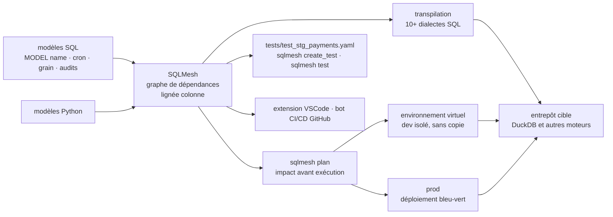

# TobikoData/sqlmesh

> **Framework de transformation de données en SQL ou Python, avec environnements de développement virtuels et workflow plan/apply.**

## Le problème

Modifier une transformation dans un entrepôt de données se fait à l'aveugle : on ne sait pas
quels modèles en aval cassent, ni combien de tables vont être reconstruites, ni ce que la
facture va donner. Se faire un environnement de test signifie recopier des données, donc
payer deux fois, et les tests unitaires demandent un outillage à part.

## Ce que ça fait vraiment

SQLMesh lit des modèles définis en SQL (ou en Python) et en déduit le graphe de dépendances,
y compris la lignée **au niveau colonne**. Un modèle se déclare avec un bloc `MODEL (...)`
portant son `name`, son `cron`, son `grain` et ses `audits` — le README donne
`tcloud_demo.stg_payments` avec des audits `UNIQUE_VALUES` et `NOT_NULL` — sans couche
`Jinja` + `YAML` par-dessus.

Le workflow annoncé est celui de Terraform : `plan` montre l'impact d'un changement avant
exécution, `apply` le réalise. Les *virtual data environments* créent un environnement de
développement isolé sans recopier les données de l'entrepôt, ce qui permet des déploiements
bleu-vert et un `data diff` entre prod et dev sur les seules tables touchées.

SQLMesh suit ce qui a déjà été calculé et ne reconstruit une table qu'une fois, en ne
relançant que les partitions nécessaires pour les modèles incrémentaux. Il transpile le SQL
écrit dans un dialecte vers celui de l'entrepôt cible à la volée, et détecte les erreurs de
transformation avant l'envoi, sur 10+ moteurs d'exécution.

Enfin, `sqlmesh create_test` génère un fichier de test unitaire YAML depuis une requête
réelle, et `sqlmesh test` le rejoue localement. Une extension VSCode et un bot CI/CD GitHub
complètent le CLI.

## Comment c'est branché



Aucun diagramme tiré du code n'existe pour ce dépôt : ce schéma est reconstruit depuis le
seul README, qui renvoie par ailleurs à une image d'architecture (`docs/readme/architecture_diagram.png`)
non lisible ici.

## Essayer

```bash
mkdir sqlmesh-example
cd sqlmesh-example
python -m venv .venv
source .venv/bin/activate
pip install 'sqlmesh[lsp]' # install the sqlmesh package with extensions to work with VSCode
source .venv/bin/activate # reactivate the venv to ensure you're using the right installation
sqlmesh init # follow the prompts to get started (choose DuckDB)
```

Puis, pour les tests unitaires (commandes du README) :

```bash
sqlmesh create_test tcloud_demo.stg_payments --query tcloud_demo.seed_raw_payments "select * from tcloud_demo.seed_raw_payments limit 5"

# run the unit test
sqlmesh test
```

Sous Windows, le README remplace l'activation par `.\.venv\Scripts\Activate.ps1`, et note
qu'il faut parfois taper `python3` / `pip3`.

## Coût et pièges

- **Gratuit et sans clé d'API** : installation par `pip`, rien à créer comme compte pour
  démarrer. Le README ne documente ni quota, ni télémétrie, ni version bridée.
- **Le vrai coût est l'entrepôt** : SQLMesh ne calcule rien lui-même, il pilote un moteur
  (DuckDB en local pour le tutoriel, un entrepôt facturé à l'usage en vrai). L'argument de
  vente est justement de réduire cette facture en ne reconstruisant pas deux fois ; les
  requêtes restent payées par vous.
- **`sqlmesh create_test` lance une requête réelle** sur l'entrepôt pour produire la sortie
  attendue : ce n'est pas gratuit sur un moteur facturé.
- **Extra `[lsp]`** nécessaire pour l'extension VSCode, et le README insiste pour réactiver
  le venv après installation — signe d'un piège de chemin fréquent.
- **Licence** : le README déclare Apache 2.0 pour le code et CC-BY-4.0 pour la documentation,
  mais le lot ne renseigne pas la licence côté catalogue. L'intention est claire, la
  vérification automatique manque : d'où l'alerte conservée, à lever sur le fichier `LICENSE`.
- **Contribution** : signature DCO exigée (`CONTRIBUTING.md`).

## Ce que ce n'est pas

- **Ce n'est pas un entrepôt ni un moteur de requêtes** : pas de stockage, pas de calcul. Il
  génère et ordonnance du SQL pour un moteur que vous fournissez et payez par ailleurs.
- **Ce n'est pas un orchestrateur généraliste** : le `cron` vit dans la définition du modèle,
  le périmètre est la transformation de données, pas les pipelines arbitraires.
- **Ce n'est pas un produit d'un seul développeur ni un pur projet d'éditeur** : le dépôt est
  porté par Tobiko Data mais hébergé comme projet de la Linux Foundation. Attention tout de
  même : une offre commerciale existe autour (les exemples du README sont nommés
  `tcloud_demo`), même si le README n'en documente aucune fonction payante.

## Alternatives

- **dbt** — nommé dans le README, qui se positionne explicitement comme « plus qu'une
  alternative à dbt ». À préférer si l'écosystème, les packages et les compétences dbt de
  l'équipe pèsent plus que les environnements virtuels et le plan/apply.
- **Terraform** — cité comme modèle du workflow plan/apply, pas comme concurrent : c'est
  l'analogie à avoir en tête, pas un outil de transformation de données.

Aucune autre alternative comparable n'est nommée dans le README, et aucun voisin de catalogue
n'a été fourni avec ce dépôt.

## Pour toi

À adopter si vous tenez un entrepôt avec plus d'une poignée de modèles : la lignée au niveau
colonne, le diff prod/dev et le non-recalcul sont exactement ce qui manque quand on hésite à
toucher une transformation en production. Pour un profil data / MLOps, le plan/apply et le bot
CI/CD sont ce qui rapproche enfin la transformation de données des pratiques de déploiement
habituelles. Passer son chemin si votre stack est déjà entièrement en dbt et que personne
n'est prêt à réécrire les définitions de modèles.
