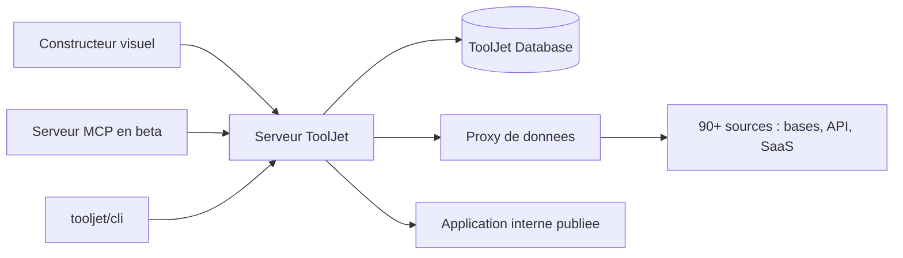

# ToolJet/ToolJet

> **Self-hostable platform for visually building internal tools on top of your own databases and APIs.**

## The problem

An admin panel, an operations dashboard or a small back-office app is always the same job:
wire up a database or an API, drop in a table and a form, handle permissions and environments.
Hand-written, every internal tool becomes one more application to host, secure and maintain
for a handful of users.

## What it actually does

ToolJet ships a visual builder and the server behind it:

- **App builder**: the README claims 80+ responsive components (tables, charts, forms, lists,
  progress bars), multi-page apps and multiplayer editing.
- **Connectors**: 90+ data sources announced — databases, APIs, cloud storage, SaaS tools —
  with a data flow described as proxy-only.
- **Built-in database**: a no-code "ToolJet Database" shipped with the platform.
- **Code where needed**: JavaScript and Python run inside apps, and plugins or connectors are
  authored with `@tooljet/cli`.
- **Agent-driven building**: a beta MCP server lets the coding agent you already use (Claude
  Code, Codex, Grok Build as plugins; Cursor or any MCP client over the server alone) generate
  pages, queries and components or edit an existing app. The README stresses that agents work
  against the platform's real contracts instead of emitting free-form code, and that these
  operations draw on your own model subscription rather than ToolJet AI credits.
- Security claimed for CE: AES-256-GCM encryption, SSO, inline comments and access control.

## How it is wired



Everything goes through the server: the visual builder and the MCP server produce the same app
definition, which the server executes by reaching external sources through its proxy — the
README states data flows only that way. The built-in database covers the case where you have
no database to connect, and the CLI adds connectors. The README names no file of the
repository, so this diagram stays at the level of the components it describes.

## Trying it

```bash
docker run \
  --name tooljet \
  --restart unless-stopped \
  -p 80:80 \
  --platform linux/amd64 \
  -v tooljet_data:/var/lib/postgresql/13/main \
  tooljet/try:ee-lts-latest
```

That is the only command in the README. It recommends the LTS tag over `latest` when
upgrading, and points to the documentation for real deployments (Docker, Kubernetes, EC2, ECS,
OpenShift, Helm, EKS, GKE, AKS, Cloud Run, DigitalOcean, Azure Container).

## Cost and traps

Docker is enough for a trial, but that image binds port 80 and carries a PostgreSQL 13 in a
volume — not a production setup. Two traps around licence and edition: the trial image is
`ee-lts-latest`, i.e. the enterprise edition, while the repository is the Community Edition;
and most of what ToolJet sells today (AI app generation, AI query builder, agents, workflows,
modules, RBAC, SCIM, multi-environment, GitSync, white-labeling, audit logs) is listed under
"ToolJet AI (Enterprise)", not CE. The code is AGPL-3.0: modifications served over a network
trigger the publication obligation. ToolJet Cloud is the hosted offer, with no pricing in the
README. Note also that the README uses "seamless" twice and calls features "intelligent" —
product-page vocabulary, not a measurement.

## What it is not

Not a code generator: you get a ToolJet app, edited in the builder and run by the ToolJet
server, not a project you can take elsewhere — including when an agent built it. Not a data
science or BI tool either: charts are app components, not an analysis layer. And not a fully
open product in practice: CE is the base, the advertised value sits behind the enterprise
edition. MCP support is declared beta.

## Alternatives

No comparable alternative in the catalogue: the suggested neighbours are RAG or document-chat
applications (Mintplex-Labs/anything-llm, pipeshub-ai/pipeshub-ai, xerrors/Yuxi), not internal
tool builders. Only IBM/mcp-context-forge touches the same ground from a narrow angle —
exposing and routing MCP servers — if the MCP piece is what interests you rather than the app
platform. The README names no competitor.

## For you

Genuinely useful if you must hand business teams an interface over your databases or pipelines
without staffing a front-end: it saves time, and the MCP server makes it drivable from your
coding agent. Skip it if you are after modelling, data orchestration or MLOps tooling —
ToolJet does not play there, and the AGPL plus the CE/enterprise split are decisions to make
before investing.
