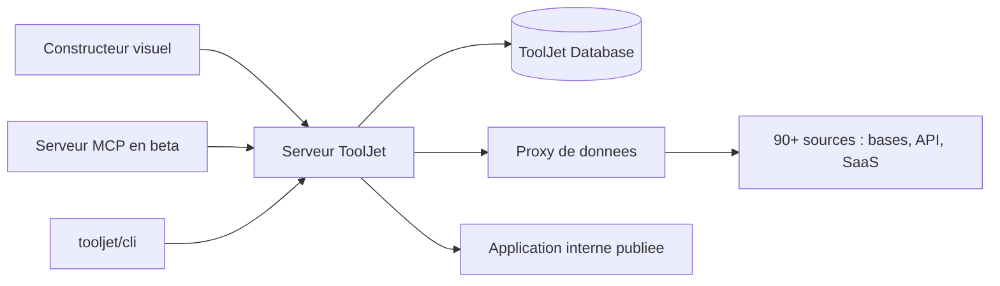

# ToolJet/ToolJet

> **Plateforme auto-hébergeable pour construire visuellement des outils internes au-dessus de ses bases et API.**

## Le problème

Un panneau d'administration, un tableau de bord d'exploitation ou une petite application
métier sont toujours le même travail : brancher une base ou une API, poser un tableau et un
formulaire, gérer les droits et les environnements. Écrit à la main, chaque outil interne
devient une application de plus à héberger, sécuriser et maintenir pour un usage restreint.

## Ce que ça fait vraiment

ToolJet fournit un constructeur visuel et le serveur qui va avec :

- **Constructeur d'applications** : le README annonce plus de 80 composants réactifs
  (tableaux, graphiques, formulaires, listes, barres de progression), des applications
  multi-pages et l'édition à plusieurs simultanément.
- **Connecteurs** : plus de 90 sources de données annoncées — bases, API, stockage cloud,
  outils SaaS — avec un flux de données décrit comme passant uniquement par le proxy.
- **Base intégrée** : une « ToolJet Database » sans code, livrée avec la plateforme.
- **Code là où il en faut** : exécution de JavaScript et de Python à l'intérieur des
  applications, et extension par plugins via le `@tooljet/cli`.
- **Construction par agent** : un serveur MCP en bêta permet à un agent de code (Claude Code,
  Codex, Grok Build en plugins ; Cursor ou tout client MCP via le serveur seul) de générer
  pages, requêtes et composants, ou de modifier une application existante. Le README souligne
  que l'agent travaille contre les contrats réels de la plateforme plutôt qu'en produisant du
  code libre, et que ces opérations consomment ton propre abonnement modèle, pas les crédits
  ToolJet AI.
- Sécurité annoncée côté CE : chiffrement AES-256-GCM, SSO, commentaires et contrôle d'accès.

## Comment c'est branché



Tout passe par le serveur : le constructeur visuel et le serveur MCP produisent la même
définition d'application, que le serveur exécute en interrogeant les sources externes à
travers son proxy — le README précise que les données ne transitent que par lui. La base
intégrée sert de stockage quand on n'a pas de base à brancher, le CLI sert à ajouter des
connecteurs. Le README ne nomme aucun fichier du dépôt : ce schéma reste au niveau des pièces
décrites.

## Essayer

```bash
docker run \
  --name tooljet \
  --restart unless-stopped \
  -p 80:80 \
  --platform linux/amd64 \
  -v tooljet_data:/var/lib/postgresql/13/main \
  tooljet/try:ee-lts-latest
```

C'est la seule commande du README. Il recommande la version LTS plutôt que `latest` pour les
mises à jour, et renvoie à la documentation pour un déploiement réel (Docker, Kubernetes,
EC2, ECS, OpenShift, Helm, EKS, GKE, AKS, Cloud Run, DigitalOcean, Azure Container).

## Coût et pièges

Docker suffit pour l'essai, et l'image citée expose le port 80 et embarque un PostgreSQL 13
dans un volume — ce n'est pas une configuration de production. Deux pièges de licence et
d'édition : l'image d'essai est `ee-lts-latest`, donc l'édition entreprise, alors que le dépôt
est la Community Edition ; et l'essentiel de ce qui fait vendre ToolJet aujourd'hui (génération
d'applications par IA, constructeur de requêtes assisté, agents, workflows, modules, RBAC,
SCIM, multi-environnements, GitSync, marque blanche, journaux d'audit) est listé sous « ToolJet
AI (Enterprise) », pas dans la CE. Le code est sous AGPL-3.0 : toute modification servie en
réseau engage l'obligation de publication. ToolJet Cloud existe comme offre hébergée, tarifs
non documentés dans le README. Enfin, le README emploie « seamless » à deux reprises et parle
de fonctions « intelligentes » — vocabulaire de page produit, à ne pas lire comme une mesure.

## Ce que ce n'est pas

Ce n'est pas un générateur de code : on obtient une application ToolJet, éditée dans le
constructeur et exécutée par le serveur ToolJet, pas un projet qu'on emporte ailleurs — y
compris quand c'est un agent qui l'a construite. Ce n'est pas non plus un outil de data
science ou de BI : les graphiques sont des composants d'application, pas une couche
d'analyse. Et ce n'est pas un produit entièrement libre en pratique : la CE est le socle, la
valeur ajoutée annoncée est derrière l'édition entreprise. Le support MCP est déclaré en bêta.

## Alternatives

Aucune alternative comparable dans le catalogue : les voisins proposés sont des applications
de RAG ou de chat documentaire (Mintplex-Labs/anything-llm, pipeshub-ai/pipeshub-ai,
xerrors/Yuxi), pas des constructeurs d'outils internes. Seul IBM/mcp-context-forge touche au
même sujet par un angle étroit — exposer et router des serveurs MCP — si c'est la brique MCP
qui t'intéresse plutôt que la plateforme applicative. Le README ne cite aucun concurrent.

## Pour toi

Intérêt réel si tu dois livrer à des métiers une interface au-dessus de tes bases ou de tes
pipelines sans y consacrer un front-end : c'est du temps gagné, et le serveur MCP rend la
chose pilotable depuis ton agent de code. À écarter si tu cherches un outil de modélisation,
d'orchestration de données ou de MLOps — ToolJet ne joue pas sur ce terrain, et l'AGPL plus le
découpage CE/entreprise se décident avant d'investir.
