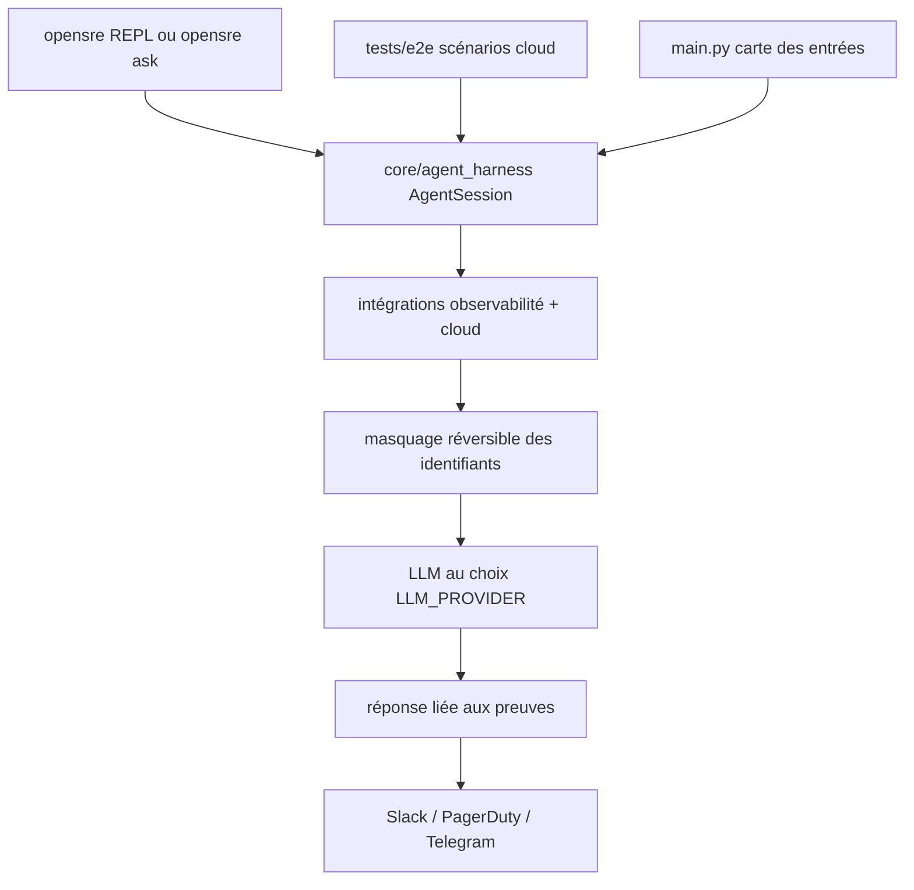

# Tracer-Cloud/opensre

> Cadre ouvert d'agents SRE qui corrèlent logs, métriques et traces pour diagnostiquer un incident.

## Le problème
Quand la production casse, les indices sont éparpillés entre logs, métriques, traces, runbooks et fils Slack.
Contrairement au code, la réponse à incident n'a pas d'équivalent de SWE-bench : pas de données d'entraînement, pas de retour clair.

## Ce que ça fait vraiment
Sur une question ou une alerte : récupère le contexte corrélé, masque les identifiants sensibles avant appel externe, teste des hypothèses en boucle d'outils, répond avec les preuves liées, propose les suites, publie un résumé sur Slack, PagerDuty ou Telegram.
Trois entrées : REPL interactif avec commandes slash (`/status`, `/cost`, `/sessions`, `/resume`, `/integrations`, `/agents`), CLI sans interaction (`opensre ask`), et API Python (`AgentSession`).
Connexion annoncée à plus de 60 outils : observabilité (Grafana, Datadog, CloudWatch, Sentry, Splunk…), infrastructure, bases, plateformes de données, gestion d'incidents, MCP et ACP.
Modèle au choix : Anthropic, OpenAI, Codex, Ollama, Gemini, OpenRouter, TrustedRouter, NVIDIA NIM, Bedrock.

## Comment c'est branché


## Essayer
```bash
curl -fsSL https://install.opensre.com | bash
opensre
opensre ask "why is checkout-api slow?"
opensre setup --dev
opensre integrations setup
opensre fleet scan
opensre update
opensre uninstall
export OPENSRE_NO_TELEMETRY=1
```

## Coût et pièges
Alpha publique annoncée comme pas encore stable, API et intégrations susceptibles de changer.
Le premier lancement exige un compte et active le modèle hébergé ; le shell ne s'ouvre que pour un compte actif. Analytique produit et Sentry sont opt-out. En auto-hébergé, il faut `LLM_PROVIDER`, la clé correspondante, et `DATABASE_URI`/`REDIS_URI` pour la persistance.

## Ce que ce n'est pas
Pas encore un benchmark : l'environnement d'apprentissage par renforcement pour la réponse à incident est l'objectif déclaré, pas l'état actuel.
Pas utilisable sans authentification : le compte conditionne le démarrage du REPL.
Pas un outil de remédiation automatique par défaut — l'exécution d'actions correctives est présentée comme facultative.

## Alternatives
Aucune alternative nommée ; SWE-bench est cité comme analogie, pas comme concurrent.

## Pour toi
À suivre pour la partie masquage et preuves liées ; l'alpha et le compte obligatoire excluent un usage sérieux maintenant.
