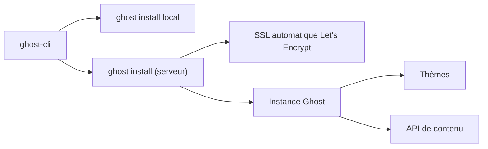

# TryGhost/Ghost

> Plateforme de publication et de newsletter, auto-hébergeable ou en service géré.

## Le problème
Publier un site éditorial suppose hébergement, CDN, sauvegardes, sécurité et maintenance — du temps pris sur l'écriture.

## Ce que ça fait vraiment
Le README fourni se concentre sur l'installation. Une CLI, `ghost-cli`, installe une instance en local (`ghost install local`, en moins d'une minute) ou sur un serveur (`ghost install`, avec configuration SSL automatique via Let's Encrypt). La documentation officielle couvre la pile d'hébergement recommandée, la montée de version, le développement de thèmes et l'API. Une newsletter de changelog et un forum communautaire assurent le suivi.

## Comment c'est branché


## Essayer
```bash
npm install ghost-cli -g
ghost install local
ghost install
```

## Coût et pièges
L'auto-hébergement est gratuit mais te laisse CDN, sauvegardes, sécurité et maintenance sur les bras. L'offre gérée Ghost(Pro) est payante ; le README indique que 100 % de ses revenus vont à la Ghost Foundation et financent le projet. Le support e-mail 24/7 est réservé aux clients Ghost(Pro).

## Ce que ce n'est pas
Le README ne documente ni les prérequis système, ni la base de données, ni les versions de Node supportées : tout est renvoyé à la doc. Ce n'est pas un générateur de site statique.

## Alternatives
Aucune alternative nommée dans le README.

## Pour toi
À surveiller : hors de ton cœur de métier data/IA, mais le bon choix si tu dois publier une newsletter technique auto-hébergée.
