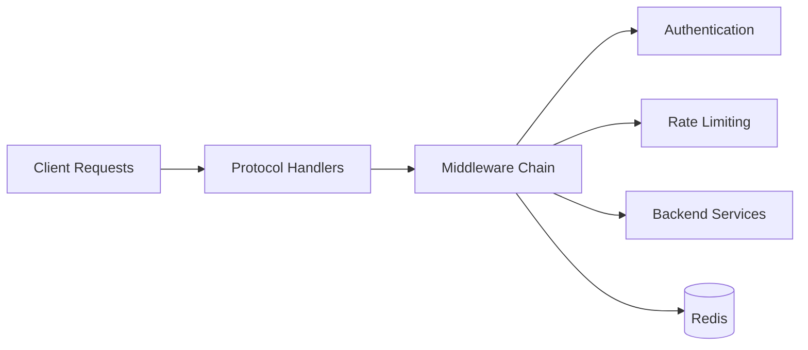

# TykTechnologies/tyk

> Passerelle API open source en Go (REST, GraphQL, gRPC, TCP) avec auth, quotas et analytics.

## Le problème
Exposer des API demande auth, limitation de débit, versionnage et journalisation, qu'on ne veut pas recoder dans chaque service.

## Ce que ça fait vraiment
Passerelle avec chaîne de middlewares : OIDC, JWT, Basic, certificats clients, rate limiting et quotas.
Import de specs OpenAPI/Swagger, transformation de requêtes/réponses, CORS, webhooks sur événements.
Plugins en Python, JavaScript, Go ou tout langage gRPC ; rechargement à chaud ; Redis comme stockage.
Opérateur Kubernetes et outils compagnons (Pump, Identity Broker, Sync).

## Comment c'est branché
Le graphe fourni n'a aucun composant lisible ; schéma d'après l'explication :


## Essayer
```bash
git clone https://github.com/TykTechnologies/tyk-gateway-docker
cd tyk-gateway-docker
docker-compose up
curl localhost:8080/hello
```

## Coût et pièges
Cœur sous MPL v2.0, dossier `ee` sous licence commerciale ; GitHub ne reconnaît pas la licence. Redis requis, même pour les tests.

## Ce que ce n'est pas
Pas la plateforme de gestion complète : Dashboard, portail développeur et plan de contrôle sont dans l'offre Self Managed ou Cloud payante.

## Alternatives
Aucune nommée dans le README.

## Pour toi
À ignorer : utile pour une équipe plateforme qui publie des API, pas pour servir ou suivre des modèles ; trop lourd pour exposer un simple endpoint d'inférence.
