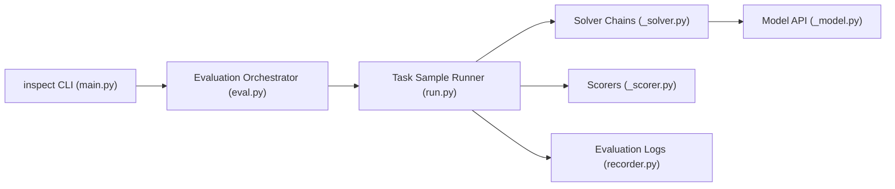

# UKGovernmentBEIS/inspect_ai

> Cadre Python d'évaluation de LLM créé par l'AI Security Institute britannique, pour ingénieurs IA.

## Le problème
Comparer des modèles et des agents de façon reproductible : prompts, outils, dialogues multi-tours, notation, journaux.

## Ce que ça fait vraiment
Une tâche combine jeu de données, chaînes de solveurs, appels au modèle, outils et notateurs. Adaptateurs pour OpenAI, Anthropic, Google, Bedrock, Azure, Hugging Face, modèles locaux. Agents (ReAct, sous-agents), outils MCP, bacs à sable Docker, journaux typés, reprise après interruption, visionneuse web. Plus de 200 évaluations prêtes à l'emploi.

## Comment c'est branché


## Essayer
Le README ne donne que les commandes de développement :
```bash
git clone https://github.com/UKGovernmentBEIS/inspect_ai.git
cd inspect_ai
pip install -e ".[dev]"
make check
make test
```

## Coût et pièges
Les évaluations appellent des modèles payants : facture à ta charge. Les bacs à sable demandent Docker. La documentation d'usage est sur un site externe, non reproduit dans le README.

## Ce que ce n'est pas
Pas un jeu de benchmarks figé : c'est le moteur. Le README ne présente pas l'installation utilisateur.

## Alternatives
Aucune alternative nommée dans le README.

## Pour toi
À adopter : cadre d'évaluation soutenu par une institution, actif (push récent), directement utile pour mesurer tes modèles et agents.
