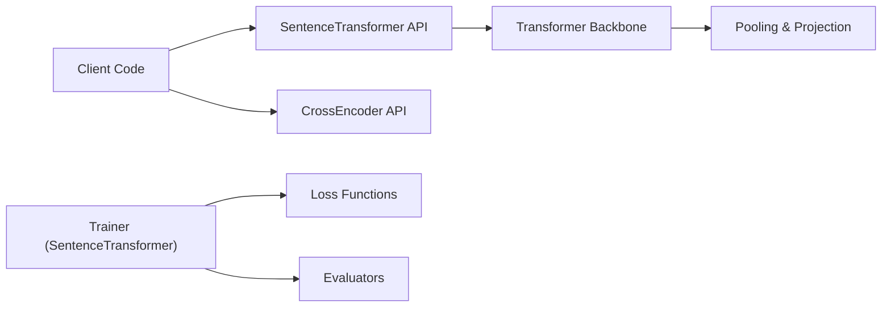

# UKPLab/sentence-transformers

> Bibliothèque Python pour calculer des embeddings, rerankers et encodeurs épars, et pour les affiner.

## Le problème
Comparer des textes ou faire de la recherche sémantique exige des embeddings de qualité et un moyen simple de les entraîner sur ses données.

## Ce que ça fait vraiment
Fournit quatre familles de modèles : SentenceTransformer (embeddings denses), CrossEncoder (rerankers), SparseEncoder (SPLADE) et MultiVectorEncoder (ColBERT). Plus de 15 000 modèles préentraînés sont disponibles sur Hugging Face. Un entraîneur intègre plus de 20 fonctions de perte pour embeddings, évaluations, et applications de recherche sémantique, clustering, minage de paraphrases. Maintenu par Tom Aarsen (Hugging Face).

## Comment c'est branché


## Essayer
```bash
pip install -U sentence-transformers
python -c "from sentence_transformers import SentenceTransformer; m=SentenceTransformer('sentence-transformers/all-MiniLM-L6-v2'); print(m.encode(['The weather is lovely today.']).shape)"
python -m pip install -e ".[dev]"
pytest
```

## Coût et pièges
Gratuit ; Python 3.10+, PyTorch 2.2+ et transformers v5.0+ recommandés. Les modèles se téléchargent depuis Hugging Face. Le catalogue ne renseigne pas la licence ; le README pointe vers un fichier LICENSE du dépôt huggingface.

## Ce que ce n'est pas
Pas un magasin vectoriel : il calcule les embeddings, il ne les stocke pas. Le README précise que le dépôt d'origine est du logiciel expérimental publié à titre de référence d'article.

## Alternatives
Aucune alternative nommée dans le README.

## Pour toi
Adopter : brique de base pour la recherche sémantique et le reranking, avec un large choix de modèles ; vérifier la licence exacte dans le dépôt.
