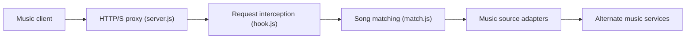

# UnblockNeteaseMusic/server

> Proxy Node.js qui remplace les titres grisés de NetEase Cloud Music par des sources alternatives.

## Le problème
Certains titres du client NetEase sont indisponibles (restrictions de droits ou de région).

## Ce que ça fait vraiment
Proxy HTTP/HTTPS (avec PAC) qui intercepte les requêtes du client NetEase, cherche le titre chez d'autres fournisseurs (QQ, Kugou, Kuwo, Migu, JOOX, YouTube via yt-dlp, Bilibili…) et renvoie l'URL de remplacement. Options : IP réelle, proxy amont, mode strict, relais en Chine, VIP local, blocage de pubs. Utilisable aussi comme bibliothèque.

## Comment c'est branché


## Essayer
```bash
npm install @unblockneteasemusic/server
npx -p @unblockneteasemusic/server unblockneteasemusic
node app.js -o bilibili ytdlp
```

## Coût et pièges
Gratuit ; cookies de certains fournisseurs requis. Certificat auto-signé pour les clients récents. Ne pas exposer le proxy sans mode strict.

## Ce que ce n'est pas
Pas de démo en ligne : le README déconseille les proxys publics tiers. Contourne des restrictions de droits ; statut légal non traité.

## Alternatives
Plusieurs projets cités dans les remerciements, dont Unblock163MusicClient.

## Pour toi
À ignorer : sans rapport avec data/IA, et touche aux restrictions de droits.

