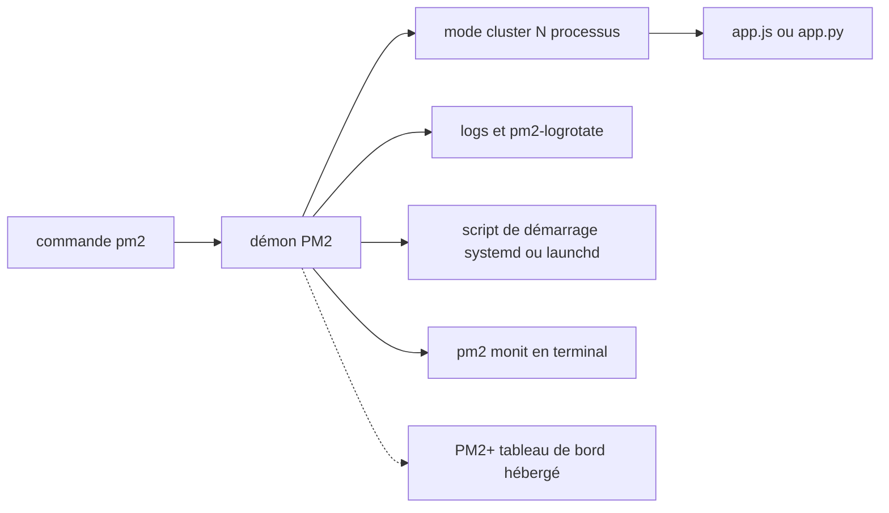

# Unitech/pm2

> **Command-line process manager that keeps Node.js applications running in production.**

## The problem

Without it, a Node.js app started by hand dies with the terminal, does not come back after a crash or a reboot, uses a single core, and every update means downtime. Logs scatter, and each app needs its own hand-written systemd unit.

## What it actually does

PM2 daemonizes the application it starts and keeps it alive, monitoring it. Cluster mode starts several Node.js processes and load-balances HTTP/TCP/UDP queries between them, with the instance count given as `max`, `-1` or a number. It reloads without downtime (`pm2 reload`). It centralizes logs, with standard, raw, JSON and formatted output, plus rotation through the `pm2-logrotate` module. It generates a startup script for systemd, upstart, systemv, openrc, launchd, rcd, rcd-openbsd and smf, and can freeze the process list across reboots. It offers terminal monitoring (`pm2 monit`) and a `pm2-runtime` binary as a drop-in replacement for `node` inside containers. It also starts non-Node programs: Python, Ruby, binaries found in `$PATH`.

## How it is wired



The README does not describe the internal architecture of the code, so this diagram only shows the parts it names. The `pm2` command talks to a daemon that owns the process list; cluster mode duplicates the app into N processes and balances traffic across them; logs, the startup script and the `monit` view all hang off that same daemon. The dotted link to PM2+ is optional, and the README does not explain how it is established.

## Trying it

```bash
$ npm install pm2 -g
$ pm2 start app.js
$ pm2 list
$ pm2 start api.js -i <processes>
$ pm2 reload all
$ pm2 logs
$ pm2 monit
$ pm2 startup
$ pm2 save
```

With Bun: `bun install pm2 -g`, and with no Node.js installed, `sudo ln -s $(which bun) /usr/local/bin/node` so the `#!/usr/bin/env node` shebang resolves to Bun. In a container the README gives `CMD [ "pm2-runtime", "npm", "--", "start" ]`. Upgrading: `npm install pm2@latest -g` then `pm2 update`.

## Cost and traps

PM2 itself costs nothing: a global npm install, so probably `sudo`, and Node.js 18+ or Bun 1+. The main trap is licensing: the README states AGPL 3.0, a network copyleft, with "for other licenses contact us" — meaning a paid license if AGPL does not fit your product. GitHub does not detect the license (NOASSERTION), which makes automated audits awkward. Second trap: PM2+ is a separate hosted service requiring an account, and the README quotes no price and no quota. Finally, `pm2 startup` writes into the init system, and `pm2 save` freezes a state you must remember to re-save after every change.

## What it is not

It is not a container orchestrator: PM2 manages processes on one machine, not a fleet. Cluster mode builds on Node.js clustering — it is not a cross-server load balancer, and it does not help the non-Node programs (Python, Ruby, binaries) that PM2 can nonetheless launch. It is not centralized observability either: `pm2 monit` is local, and multi-server aggregation belongs to PM2+, a separate product. The README uses "seamless" and "battle-tested" with nothing to back them but a link to CI.

## Alternatives

The README names no competitor — only nvm and fnm, which install Node.js and are not comparable. Among the supplied neighbours: `bcicen/ctop` gives a terminal view of containers, useful if your workloads already run in Docker rather than as bare processes; `louislam/uptime-kuma` checks availability from the outside, answering "is it up?" rather than "who restarts the process?". `cilium/cilium` and `pranshuparmar/witr` are off-topic here.

## For you

For an inference API, a scoring worker or a Streamlit dashboard sitting on a VM without Kubernetes, PM2 replaces a handful of hand-written systemd units and brings automatic restart, zero-downtime reload and logs. Check the AGPL before embedding it in a distributed product.
