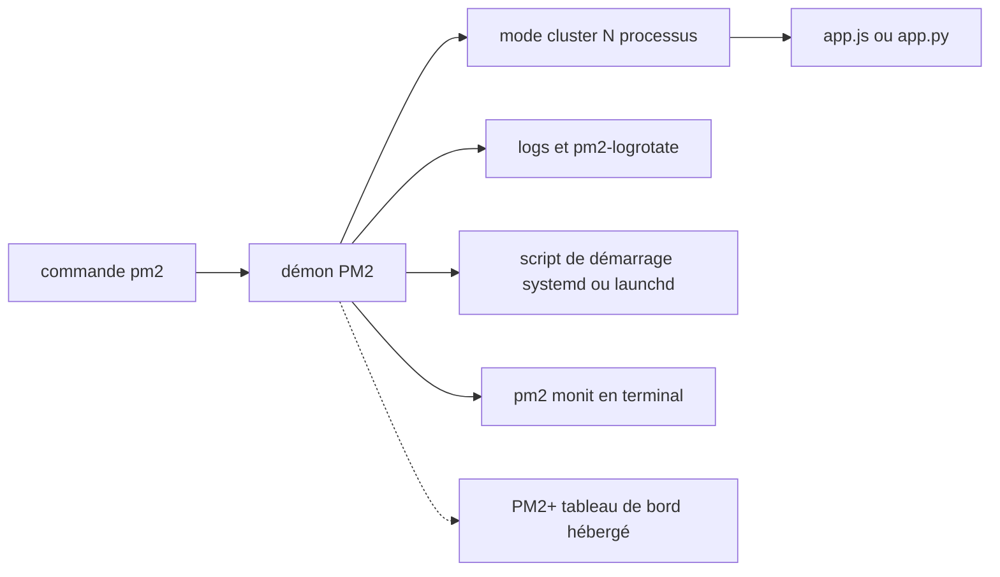

# Unitech/pm2

> **Gestionnaire de processus en ligne de commande pour garder des applications Node.js vivantes en production.**

## Le problème

Sans lui, une application Node.js lancée à la main meurt avec le terminal, ne redémarre pas après un crash ou un reboot, n'utilise qu'un seul cœur, et toute mise à jour impose une coupure. Les logs se perdent, et il faut bricoler un service systemd par application.

## Ce que ça fait vraiment

PM2 démonise l'application lancée et la maintient en vie (« kept alive forever » selon le README), en la surveillant. Le mode cluster démarre plusieurs processus Node.js et répartit les requêtes HTTP/TCP/UDP entre eux, avec un nombre d'instances au choix — `max`, `-1` ou un entier. Il sait recharger sans coupure (`pm2 reload`). Il centralise les logs, avec sorties standard, brute, JSON ou formatée, et une rotation via le module `pm2-logrotate`. Il génère un script de démarrage pour systemd, upstart, systemv, openrc, launchd, rcd, rcd-openbsd et smf, et sait geler la liste des processus. Il fournit une surveillance en terminal (`pm2 monit`) et un binaire `pm2-runtime` en remplacement direct de `node` pour les conteneurs. Il lance aussi des applications non-Node : Python, Ruby, binaires du `$PATH`.

## Comment c'est branché



Le README ne décrit pas l'architecture interne du code : ce schéma reprend uniquement les pièces qu'il nomme. La commande `pm2` parle à un démon qui détient la liste des processus ; le mode cluster en duplique N exemplaires et équilibre le trafic entre eux ; les logs, le script de démarrage et la vue `monit` sont branchés sur ce même démon. Le lien en pointillé vers PM2+ est optionnel, et le README n'explique pas comment il est établi.

## Essayer

```bash
$ npm install pm2 -g
$ pm2 start app.js
$ pm2 list
$ pm2 start api.js -i <processes>
$ pm2 reload all
$ pm2 logs
$ pm2 monit
$ pm2 startup
$ pm2 save
```

Avec Bun : `bun install pm2 -g`, et si Node.js n'est pas installé, `sudo ln -s $(which bun) /usr/local/bin/node` pour que le shebang `#!/usr/bin/env node` tombe sur Bun. En conteneur, le README donne `CMD [ "pm2-runtime", "npm", "--", "start" ]`. Mise à jour : `npm install pm2@latest -g` puis `pm2 update`.

## Coût et pièges

Rien à payer pour PM2 lui-même : installation npm globale, donc `sudo` probable, et Node.js 18+ ou Bun 1+. Le piège principal est la licence : le README annonce AGPL 3.0, copyleft réseau, avec « pour d'autres licences, contactez-nous » — c'est-à-dire un achat de licence si l'AGPL ne convient pas à ton produit. GitHub, lui, ne détecte pas la licence (NOASSERTION), ce qui complique un audit automatisé. Deuxième piège : PM2+ est un service hébergé distinct, avec compte à créer ; le README n'annonce aucun tarif ni aucun quota. Enfin, `pm2 startup` écrit dans le système d'init et `pm2 save` fige un état qu'il faut penser à réenregistrer après chaque changement.

## Ce que ce n'est pas

Ce n'est pas un orchestrateur de conteneurs : PM2 gère des processus sur une machine, pas un parc. Le mode cluster s'appuie sur le clustering Node.js — ce n'est pas un répartiteur de charge entre serveurs, et il ne bénéficie pas aux applications non-Node (Python, Ruby, binaires) que PM2 sait pourtant démarrer. Ce n'est pas non plus une solution de supervision centralisée : `pm2 monit` est local, et l'agrégation multi-serveurs relève de PM2+, produit séparé. Le README emploie « seamless » et « battle-tested » sans les étayer autrement que par un lien vers la CI.

## Alternatives

Le README ne nomme aucun concurrent — seulement nvm et fnm, qui installent Node.js et ne sont pas comparables. Parmi les voisins fournis : `bcicen/ctop` donne une vue terminal des conteneurs, utile si tes charges tournent déjà en Docker plutôt qu'en processus nus ; `louislam/uptime-kuma` surveille la disponibilité depuis l'extérieur et répond donc à « est-ce que ça marche ? », pas à « qui relance le processus ? ». `cilium/cilium` et `pranshuparmar/witr` sont hors sujet ici.

## Pour toi

Pour une API d'inférence, un worker de scoring ou un dashboard Streamlit posés sur une VM sans Kubernetes, PM2 remplace une poignée d'unités systemd écrites à la main et donne le redémarrage automatique, le rechargement sans coupure et les logs. Vérifie l'AGPL avant de l'embarquer dans un produit distribué.
