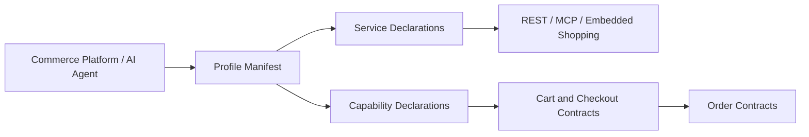

# Universal-Commerce-Protocol/ucp

> Standard ouvert de commerce entre agents IA, marchands et prestataires de paiement, pour concepteurs d'agents.

## Le problème
Chaque plateforme intègre chaque marchand à la main, ce qui bloque les achats faits par des agents.

## Ce que ça fait vraiment
C'est un dépôt de spécifications, pas un backend marchand. Il fournit des schémas JSON (profil, capacités, checkout, commande, jetons de paiement), des contrats REST, MCP et embarqué, et une documentation MkDocs. Un profil publié par le marchand permet aux agents de découvrir ses capacités. Un outil valide les exemples contre les schémas.

## Comment c'est branché


## Essayer
```bash
cargo install ucp-schema
ucp-schema lint source/
uv sync
uv run mkdocs serve --watch source
```

## Coût et pièges
Gratuit. Les outils demandent Rust (`cargo`) et `uv`. Environ 199 issues ouvertes : le standard bouge.

## Ce que ce n'est pas
Pas une implémentation de boutique ni un SDK complet. Aucune preuve dans les sources échantillonnées d'un serveur marchand ou d'un ordre d'appel vérifié.

## Alternatives
Aucune alternative nommée dans le README.

## Pour toi
À surveiller si tu construis des agents qui achètent : le protocole peut s'imposer, mais il est très jeune (créé fin 2025).

