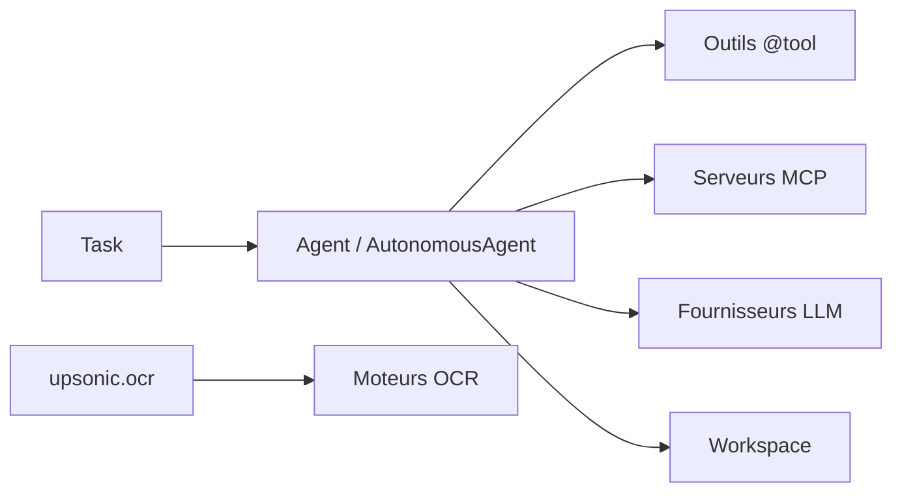

# Upsonic/Upsonic

> Framework Python pour construire des agents LLM, autonomes ou classiques, avec outils et OCR.

## Le problème
Assembler un agent avec des outils, un espace de travail sécurisé et de l'OCR demande beaucoup de plomberie.

## Ce que ça fait vraiment
`AutonomousAgent` borne les opérations fichier et shell à un `workspace` et bloque le path traversal.
`Agent` et `Task` pour des agents classiques, `@tool` pour des outils personnalisés, support MCP.
Un module OCR en couches avec plusieurs moteurs (EasyOCR, RapidOCR, Tesseract, PaddleOCR, DeepSeek OCR).
Agents préconstruits communautaires ; sandbox E2B en option.

## Comment c'est branché


## Essayer
```bash
uv pip install upsonic
uv pip install "upsonic[ocr]"
```

## Coût et pièges
Clé du fournisseur LLM à ta charge (Anthropic dans les exemples). L'architecture mentionne une télémétrie d'usage anonyme.

## Ce que ce n'est pas
Pas un produit fini : c'est un framework. L'architecture décrite (serveurs, fiabilité) semble correspondre à une version ancienne et ne recoupe pas le README.

## Alternatives
Aucune alternative nommée dans le README.

## Pour toi
À surveiller : l'API est simple et l'OCR intégré est un plus, mais rien dans le README ne le distingue nettement des frameworks d'agents établis.
