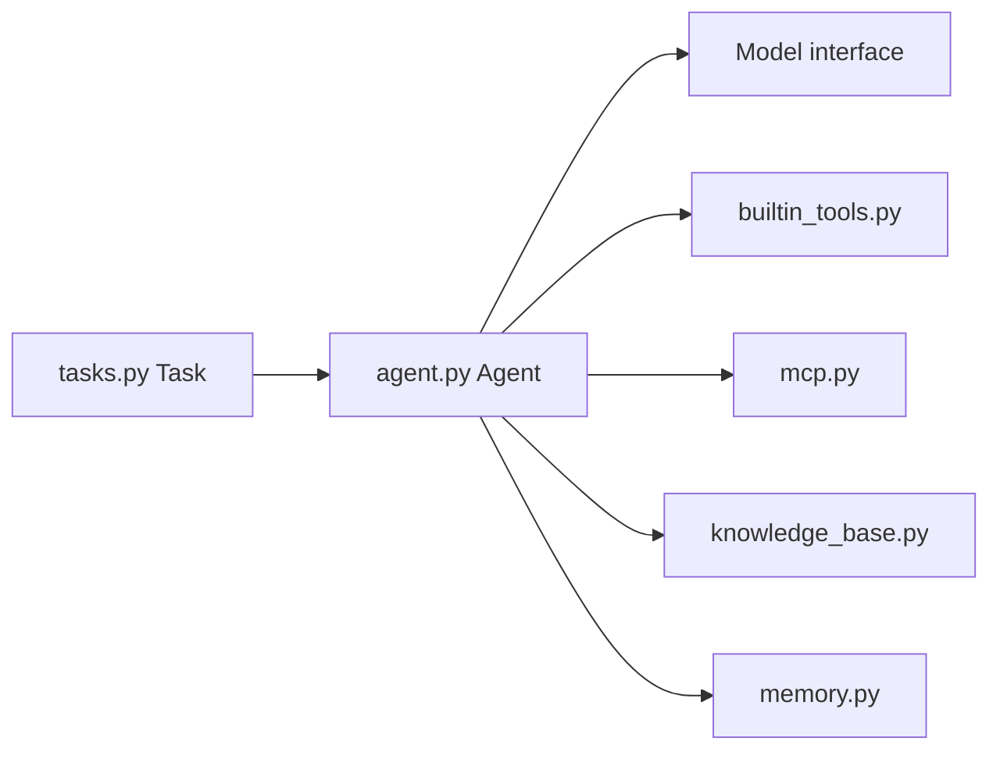

# Upsonic/gpt-computer-assistant

> Framework Python pour construire des agents IA autonomes ou classiques avec outils, mémoire et OCR.

## Le problème
Assembler un agent (modèle, outils, mémoire, documents) demande beaucoup de code de liaison.

## Ce que ça fait vraiment
Une `Task` est soumise à un `Agent` ou à un `AutonomousAgent`, qui appelle le modèle choisi et des outils (`@tool`, MCP). L'agent autonome restreint fichiers et shell à un `workspace` et bloque les commandes dangereuses. Le dépôt contient aussi équipes d'agents, base de connaissances, mémoire, graphes de workflows, suivi d'usage et un pipeline OCR à deux couches (EasyOCR, RapidOCR, Tesseract, PaddleOCR, DeepSeek OCR).

## Comment c'est branché


## Essayer
```bash
uv pip install upsonic
```
```python
from upsonic import Agent, Task
agent = Agent(model="anthropic/claude-sonnet-4-5", name="Stock Analyst Agent")
task = Task(description="Analyze the current market trends")
agent.print_do(task)
```

## Coût et pièges
Clé d'API du fournisseur de modèle à ta charge. OCR en option via `upsonic[ocr]`. Isolation cloud avec E2B proposée comme étape suivante.

## Ce que ce n'est pas
Ce n'est plus l'assistant d'ordinateur suggéré par le nom du dépôt : le README présente Upsonic, un framework d'agents.

## Alternatives
Non documenté : le README ne nomme pas d'alternative.

## Pour toi
Surveiller : option MIT raisonnable pour prototyper des agents Python, mais sans comparaison documentée avec les autres frameworks.

