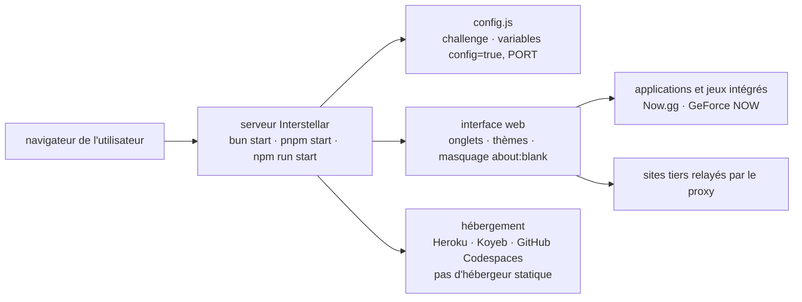

# UseInterstellar/Interstellar

> **A self-hosted web proxy with games and tab cloaking, aimed at getting around network filtering.**

## The problem

On a filtered network — the situation implied by the README's feature list: `about:blank`
cloaking, tab cloaking, optional password protection — the sites you want are blocked at the
domain level. The README never states the problem outright; it shows through those features and
through the insistence on hosting you control, since deploying to static hosts is declared
impossible.

## What it actually does

Interstellar is a Node server you run yourself, serving a web interface you browse from: traffic
goes through the deployed server rather than straight from the machine. The README calls it a
"web proxy" with a menu-driven interface, and claims over 15 million users since 2022.

The advertised features are a collection of apps and games, a built-in tab system, several
themes, an element inspector, tab cloaking and `about:blank` cloaking, optional password
protection, plus Now.gg and GeForce NOW support. The README also describes speeds as "fast":
an unsupported claim, repeated here only as such.

Configuration comes down to a `config.js` file (whose `challenge` key enables password
protection) and environment variables passed at startup, chiefly `config=true` and `PORT`. An
`Ad-Free` branch exists, which means the main branch carries ads — and the README explicitly
asks you to keep them to fund the project.

## How it is wired



No code-derived diagram exists for this repository: the graph above is reconstructed from the
README alone, which names a single file, `config.js`. The load-bearing node is hosting: the
README states that Netlify, Cloudflare Pages and GitHub Pages are ruled out, so a running server
process is mandatory.

## Trying it

```bash
git clone https://github.com/UseInterstellar/Interstellar
cd Interstellar
```

Then, depending on the package manager:

```bash
bun i
bun start
```

```bash
pnpm i
pnpm start
```

```bash
npm i
npm run start
```

Ad-free variant, password protection and updating:

```bash
git clone --branch Ad-Free https://github.com/UseInterstellar/Interstellar
cd Interstellar

config=true pnpm start   # or $env:config=true; pnpm start depending on the server

cd Interstellar
git pull --force --allow-unrelated-histories # This may overwrite your local changes
```

On GitHub Codespaces the README gives `pnpm i && pnpm start`, requires clicking "Make public"
on the application popup, and suggests `PORT=6969 pnpm start` when no popup appears; a port
below 1023 needs `sudo PORT=1023`.

## Cost and pitfalls

- **AGPL-3.0 licence** per the catalogue: network copyleft. Exposing a service built from a
  modified version obliges you to publish the sources. That is the alert kept.
- **Ads by default**: the main branch carries them and the README asks you to keep them. The
  documented alternative is the `Ad-Free` branch.
- **Hosting is on you**: static hosts are excluded. That leaves Heroku, Koyeb and GitHub
  Codespaces (buttons and instructions provided), plus other methods the README points to its
  Discord for rather than documenting. Replit has not been free since 1 January 2024, as the
  README notes.
- **Ports and visibility**: on Codespaces, forgetting to make the port public yields a "Range
  Error" and a non-functioning proxy — the README repeats this three times.
- **Destructive update**: the documented `git pull --force --allow-unrelated-histories`
  overwrites local changes, as the README's own comment says.
- **Support leans on Discord**: alternative deployment documentation is not in the repository.

## What it is not

- **It is not an anonymity tool or a VPN.** The README promises no encryption, no
  no-logging policy and no privacy protection: tab cloaking and `about:blank` fool a human
  looking at the screen, not the network operator nor whoever runs the server you deploy.
- **It is not a ready-to-use public instance**: it is code you deploy yourself, and whoever
  hosts it becomes the intermediary for all traffic passing through.
- **It is not a reusable building block**: no API, no library, no documented extension point;
  the only exposed knobs are `config.js` and two environment variables.
- **It is not neutral in use**: bypassing the filtering of a network you do not own puts the
  responsibility on whoever deploys it, a question the README does not address.

## Alternatives

No comparable alternative in the catalogue. The suggested neighbours
(`aws-samples/bedrock-access-gateway`, `BerriAI/litellm`, `InternLM/lmdeploy`,
`flashinfer-ai/flashinfer`) are all gateways or inference engines for language models: the word
"proxy" in the lexicon puts them next to Interstellar, but none relays web browsing. The README
names no competing project either.

## For you

Skip it for a data / AI / MLOps profile: nothing to take away on models, data or productionising,
and the one transferable technical point — a Node server relaying traffic — is not documented at
code level. Worth a look only as an object of observation, if client-side circumvention practices
interest you; and in that case note that AGPL plus ads by default make it a poor candidate for
internal reuse.
