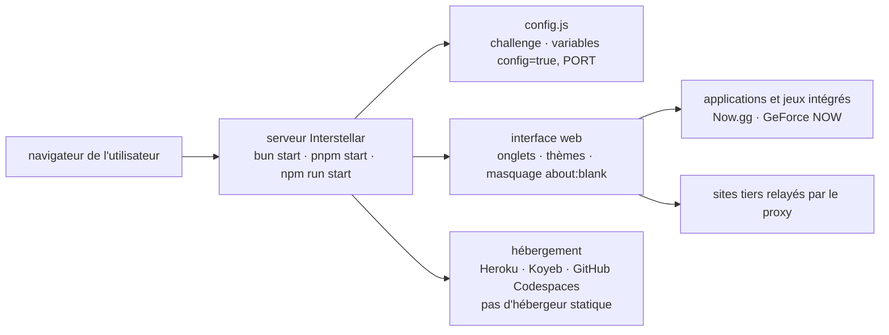

# UseInterstellar/Interstellar

> **Un proxy web à auto-héberger, avec jeux et masquage d'onglet, destiné à contourner un filtrage réseau.**

## Le problème

Sur un réseau filtré — le cas visé par les fonctions du README : masquage `about:blank`,
masquage d'onglet, protection par mot de passe — les sites voulus sont bloqués au niveau du
domaine. Le README ne formule pas le problème explicitement ; il se lit dans la liste des
fonctions et dans l'insistance sur un hébergement que l'on possède, puisque le déploiement sur
hébergeurs statiques est annoncé comme impossible.

## Ce que ça fait vraiment

Interstellar est un serveur Node à faire tourner soi-même, qui sert une interface web depuis
laquelle on navigue : le trafic passe par le serveur déployé plutôt que directement par le
poste. Le README le présente comme un « web proxy » avec une interface à menus, et revendique
plus de 15 millions d'utilisateurs depuis 2022.

Les fonctions annoncées sont une collection d'applications et de jeux, un système d'onglets
intégré, plusieurs thèmes, un inspecteur d'éléments, le masquage d'onglet et le masquage
`about:blank`, une protection par mot de passe facultative, ainsi que la prise en charge de
Now.gg et de GeForce NOW. Le README qualifie aussi les vitesses de « rapides » : c'est une
affirmation non étayée, reprise ici seulement comme telle.

Le paramétrage tient à un fichier `config.js` (dont la clé `challenge` active la protection par
mot de passe) et à des variables d'environnement passées au démarrage, notamment `config=true`
et `PORT`. Une branche `Ad-Free` existe : la branche principale affiche donc de la publicité,
et le README demande explicitement de la conserver pour financer le projet.

## Comment c'est branché



Aucun diagramme tiré du code n'existe pour ce dépôt : ce schéma est reconstruit depuis le seul
README, qui ne nomme qu'un seul fichier, `config.js`. Le point structurant est le nœud
« hébergement » : le README indique que Netlify, Cloudflare Pages et GitHub Pages sont exclus,
donc qu'un processus serveur est obligatoire.

## Essayer

```bash
git clone https://github.com/UseInterstellar/Interstellar
cd Interstellar
```

Puis, selon le gestionnaire de paquets :

```bash
bun i
bun start
```

```bash
pnpm i
pnpm start
```

```bash
npm i
npm run start
```

Variante sans publicité, protection par mot de passe et mise à jour :

```bash
git clone --branch Ad-Free https://github.com/UseInterstellar/Interstellar
cd Interstellar

config=true pnpm start   # ou $env:config=true; pnpm start selon le serveur

cd Interstellar
git pull --force --allow-unrelated-histories # This may overwrite your local changes
```

Sur GitHub Codespaces, le README donne `pnpm i && pnpm start`, impose de cliquer « Make
public » sur la fenêtre de l'application, et propose `PORT=6969 pnpm start` s'il n'y a pas de
fenêtre ; un port sous 1023 exige `sudo PORT=1023`.

## Coût et pièges

- **Licence AGPL-3.0** d'après le catalogue : copyleft réseau. Un service exposé à partir d'une
  version modifiée oblige à en publier les sources. C'est l'alerte retenue.
- **Publicité par défaut** : la branche principale en contient, et le README demande de la
  garder. L'alternative documentée est la branche `Ad-Free`.
- **Hébergement à ta charge** : les hébergeurs statiques sont exclus. Restent Heroku, Koyeb,
  GitHub Codespaces (boutons et instructions fournis), et d'autres méthodes que le README
  renvoie au Discord plutôt que de documenter. Replit n'est plus gratuit depuis le 1er janvier
  2024, le README le signale.
- **Ports et visibilité** : sur Codespaces, oublier de rendre le port public provoque une
  « Range Error » et un proxy non fonctionnel — le README y revient trois fois.
- **Mise à jour destructrice** : le `git pull --force --allow-unrelated-histories` documenté
  écrase les modifications locales, ce que le README indique en commentaire.
- **Support adossé à un Discord** : la documentation de déploiement alternatif n'est pas dans le
  dépôt.

## Ce que ce n'est pas

- **Ce n'est pas un outil d'anonymat ni un VPN.** Le README ne promet ni chiffrement, ni
  non-journalisation, ni protection de la vie privée : le masquage d'onglet et `about:blank`
  trompent un observateur humain devant l'écran, pas l'opérateur du réseau ni celui du serveur
  que l'on déploie.
- **Ce n'est pas une instance publique prête à l'emploi** : c'est du code à déployer soi-même,
  et celui qui héberge devient l'intermédiaire de tout le trafic qui passe.
- **Ce n'est pas une brique réutilisable** : aucune API, aucune bibliothèque, aucun point
  d'extension documenté ; le seul réglage exposé est `config.js` et deux variables
  d'environnement.
- **Ce n'est pas un projet neutre d'usage** : contourner le filtrage d'un réseau que l'on ne
  possède pas engage la responsabilité de celui qui déploie, question que le README n'aborde
  pas.

## Alternatives

Aucune alternative comparable dans le catalogue. Les voisins proposés
(`aws-samples/bedrock-access-gateway`, `BerriAI/litellm`, `InternLM/lmdeploy`,
`flashinfer-ai/flashinfer`) sont tous des passerelles ou des moteurs d'inférence pour modèles
de langage : le mot « proxy » du lexique les rapproche d'Interstellar, mais aucun ne relaie de
la navigation web. Le README ne nomme par ailleurs aucun projet concurrent.

## Pour toi

À ignorer pour un profil data / IA / MLOps : rien à en tirer côté modèles, données ou
industrialisation, et le seul point technique transposable — un serveur Node qui relaie du
trafic — n'est pas documenté au niveau du code. À ne considérer que comme objet d'observation,
si l'on s'intéresse aux usages de contournement côté poste client ; et dans ce cas, noter que
l'AGPL et la publicité par défaut en font un mauvais candidat à la reprise interne.
