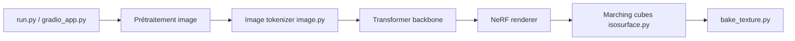

# VAST-AI-Research/TripoSR

> Modèle feed-forward qui reconstruit un objet 3D à partir d'une seule image, pour créateurs et chercheurs.

## Le problème
Obtenir un maillage 3D depuis une photo demande d'ordinaire plusieurs vues ou un long temps d'optimisation.

## Ce que ça fait vraiment
Inspiré du Large Reconstruction Model : l'image est validée, débarrassée du fond, tokenisée, passée dans un backbone transformer produisant des « scene codes » ; rendu NeRF puis extraction de maillage par marching cubes, avec bake de texture optionnel. Le README annonce moins de 0,5 s sur un A100 ; l'option par défaut demande environ 6 Go de VRAM.

## Comment c'est branché


## Essayer
```bash
pip install --upgrade setuptools
pip install -r requirements.txt
python run.py examples/chair.png --output-dir output/
python gradio_app.py
```

## Coût et pièges
GPU CUDA conseillé, version de CUDA de la machine alignée avec celle de PyTorch. Licence MIT annoncée pour le code, les modèles et la démo.

## Ce que ce n'est pas
Pas une reconstruction multi-vues : une seule image en entrée. Le rendu dépend de la qualité de la détourage.

## Alternatives
Aucune alternative nommée dans le README (qui cite un rapport technique de comparaison).

## Pour toi
À surveiller : facile à essayer sur un GPU modeste pour de la génération 3D, mais dernier commit en juin 2026 et aucun rapport avec les pipelines MLOps courants.

