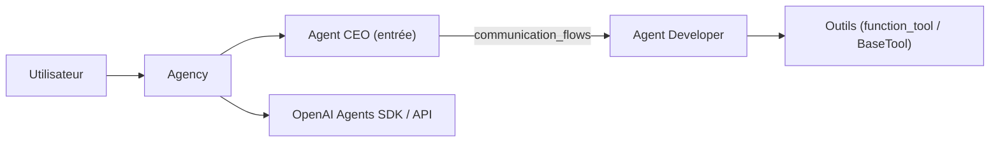

# VRSEN/agency-swarm

> Framework Python pour orchestrer des équipes d'agents IA, bâti sur le SDK OpenAI Agents.

## Le problème
Coordonner plusieurs agents aux rôles distincts avec des règles claires sur qui peut parler à qui.

## Ce que ça fait vraiment
Tu définis des agents (rôle, instructions, outils Pydantic ou `@function_tool`) et une `Agency` avec des `communication_flows` directionnels (`ceo > dev`). Les agents échangent via un outil `send_message`. L'historique peut être persisté par callbacks, et des outils peuvent être générés depuis des schémas OpenAPI. D'autres modèles passent par LiteLLM. Démo web (`copilot_demo`) ou terminal (`tui`). Le schéma GitDiagram décrit l'ancienne v0.x.

## Comment c'est branché


## Essayer
```bash
pip install -U agency-swarm
export OPENAI_API_KEY="YOUR_API_KEY"
# puis en Python : agency.copilot_demo()  ou  agency.tui()
```

## Coût et pièges
Python 3.12+ ; appels d'API à ta charge. Les migrations depuis la v0.x sont cassantes (guide fourni). Le README mentionne une offre de services de l'auteur.

## Ce que ce n'est pas
Pas un produit fini : un cadre de code centré sur OpenAI. Le README parle de fiabilité mais ne donne aucune mesure.

## Alternatives
- OpenAI Agents SDK : la base sur laquelle le framework s'appuie.

## Pour toi
À surveiller : pratique pour prototyper une équipe d'agents avec des flux de communication explicites, mais il t'attache au SDK OpenAI et à un mainteneur principal.
