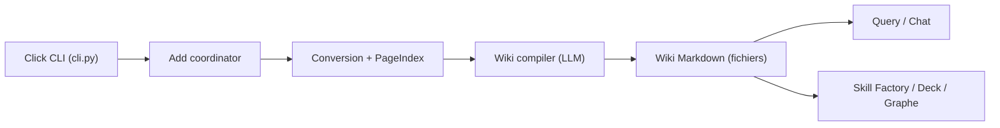

# VectifyAI/OpenKB

> CLI qui compile des documents en wiki Markdown interconnecté par LLM, avec retrait sans vecteurs.

## Le problème
Le RAG classique redécouvre le savoir à chaque requête et rien ne s'accumule entre les documents.

## Ce que ça fait vraiment
`openkb add` convertit fichiers, dossiers ou URL en Markdown (markitdown), indexe les longs PDF (≥ 20 pages) avec PageIndex en arbre, puis un agent LLM écrit résumés, pages de concepts et d'entités, liens croisés, index et journal. On interroge ensuite avec `query` ou `chat`. Les générateurs produisent des skills d'agent, des decks HTML et un graphe. Interface web optionnelle et API FastAPI. Le stockage est un système de fichiers, sans base.

## Comment c'est branché


## Essayer
```bash
pip install openkb
mkdir my-kb && cd my-kb
openkb init
openkb add paper.pdf
openkb query "What are the main findings?"
```

## Coût et pièges
Clé LLM (`LLM_API_KEY`) via LiteLLM ; chaque document déclenche de nombreux appels (un document peut toucher 10 à 15 pages). Le cloud PageIndex est optionnel. Sans jeton, l'API web n'est pas authentifiée.

## Ce que ce n'est pas
Pas un RAG vectoriel : pas d'embeddings. `recompile` écrase les modifications manuelles des pages.

## Alternatives
- PageIndex : le framework de retrait sur lequel il s'appuie.

## Pour toi
À surveiller : intéressant pour bâtir une base de connaissances consultable par agents, mais le coût en appels LLM à l'ingestion est à mesurer sur un petit corpus d'abord.
