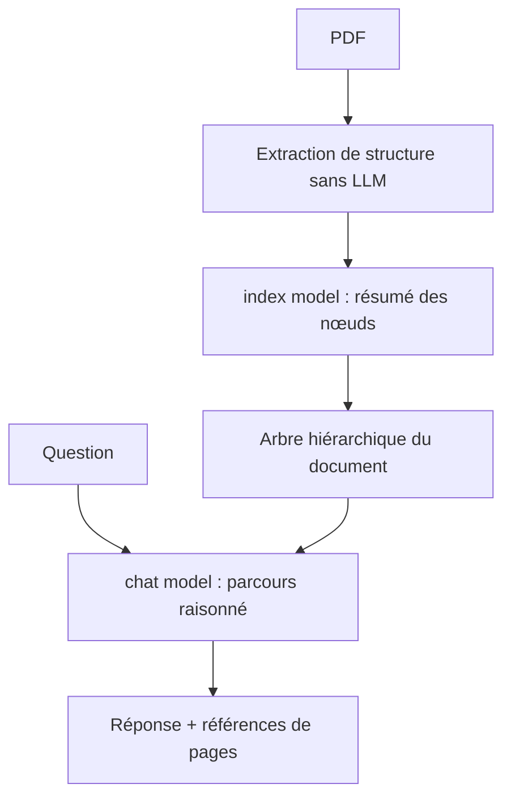

# VectifyAI/PageIndex

> Moteur RAG sans vecteurs : index arborescent d'un document, parcouru par raisonnement LLM.

## Le problème
La recherche vectorielle retourne ce qui ressemble à la question, pas ce qui y répond.
Sur un rapport de 800 pages, similarité et pertinence divergent, et le document ne tient plus dans le contexte.

## Ce que ça fait vraiment
Deux étapes : générer un index en arbre par document, puis chercher dans cet arbre par raisonnement d'un LLM, comme un expert qui ouvre la bonne section.
Pas de base vectorielle, pas de découpage en chunks ; les réponses sont traçables à des références explicites.
Mode local (index et recherche sur votre machine, votre clé LLM) ou mode Cloud (parsing, OCR, compréhension d'images, stockage gérés).
Le SDK expose `submit_document` et `chat`, et s'intègre comme outil dans l'OpenAI Agents SDK ou le Claude Agent SDK.

## Comment c'est branché


## Essayer
```bash
pip install -U pageindex
```

```python
from pageindex import PageIndexClient
client = PageIndexClient(index="gpt-5.6-luna", chat="gpt-5.6-sol")
doc_id = client.submit_document("report.pdf")["doc_id"]
print(client.chat("What was the 2023 operating margin?", doc_id=doc_id))
```

## Coût et pièges
Clé LLM à votre charge : le README annonce ~0,001 $ par page à l'indexation locale, et le modèle de chat consomme à chaque question.
OCR, images, citations au bloc, métadonnées, dossiers et serveur MCP sont réservés au Cloud, avec clé PageIndex.

## Ce que ce n'est pas
Ce n'est pas gratuit à l'usage : c'est un open source qui mène à une offre Cloud payante pour tout ce qui dépasse le PDF texte.
Ce n'est pas adapté aux documents scannés ou riches en images en mode local.
Les benchmarks annoncés (98,7 % sur FinanceBench, 62 questions sur 34 PDF) viennent du projet lui-même.

## Alternatives
Aucun dépôt concurrent n'est nommé dans le README ; il se compare au « Vector RAG » en général.

## Pour toi
À tester sérieusement si tu fais du RAG sur des documents longs et structurés : l'approche mérite une mesure sur ton corpus.
