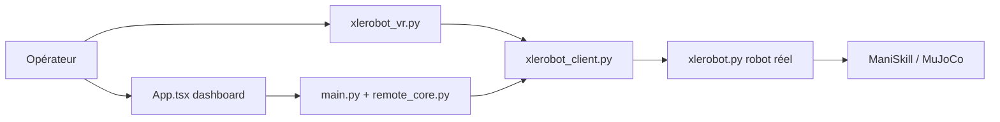

# Vector-Wangel/XLeRobot

> Robot mobile à bras pour l'IA incarnée, à construire soi-même dès 660 dollars.

## Le problème
Les plateformes de robotique incarnée coûtent cher ; il manque un robot ouvert et abordable pour expérimenter l'IA incarnée.

## Ce que ça fait vraiment
Projet matériel et logiciel : nomenclature, impression 3D, assemblage, puis code pour piloter le robot réel (version deux roues ou mecanum), téléopération VR et manette Joy-Con, simulation ManiSkill et MuJoCo, tableau de bord web de contrôle à distance avec flux vidéo et enregistrement de données. Construit sur LeRobot et SO-100/SO-101.

## Comment c'est branché


## Essayer
```bash
# le README ne documente pas de commande : suivre les étapes
# 1. Bill of Materials  2. 3D printing  3. Assemble  4. Software
```

## Coût et pièges
Environ 660 $ pour la version de base (hors impression 3D, outils, expédition, taxes), plus des options caméra et Raspberry Pi. Le README suppose des bases en Python, Ubuntu et Git, et décline toute responsabilité pour les dommages causés.

## Ce que ce n'est pas
Pas un logiciel installable seul : sans le matériel, on ne peut que simuler. Les installations sont décrites dans une documentation externe, non lue ici.

## Alternatives
LeRobot, SO-100/SO-101, Lekiwi et Bambot : projets amont, base de ce dépôt.

## Pour toi
Surveiller : porte d'entrée abordable vers la robotique et le sim2real, utile si tu veux appliquer du RL ou du VLA à un robot réel.

