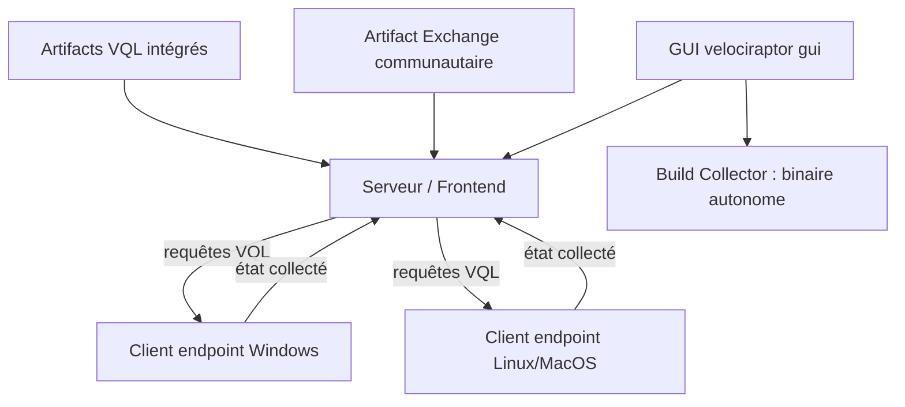

# Velocidex/velociraptor

> **One sentence.** Query host state across a fleet with a dedicated query language, driven from a central server.

## The problem

Without it, pulling state off a suspect machine — files, processes, logs — is done by hand,
host by host, with throwaway scripts that differ on Windows, Linux and MacOS.

## What it actually does

- Provides VQL, "The Velociraptor Query Language", to express what should be collected from a host.
- Packages those queries as `Artifacts`; the binary ships with a built-in set for common cases.
- Ships a GUI that, with one command, brings up the frontend, the server and a local client.
- Builds a self-contained collector from the GUI (`Server Artifacts` → `Build Collector`), configured with the chosen artifacts and downloaded from the `Uploaded Files` tab.
- Runs as a single per-platform binary, as a server via Docker, or as a local triage tool.
- Opens onto the community-maintained Artifact Exchange for extra artifacts.

## How it is wired

A central server, clients on the endpoints, VQL artifacts flowing one way and collected state the other.



## Trying it

```bash
  $ velociraptor gui
```

Building from source (Go ≥ 1.23.2, gcc, make, Node.js LTS):

```bash
    $ git clone https://github.com/Velocidex/velociraptor.git
    $ cd velociraptor
    $ cd gui/velociraptor/
    $ npm install
    $ make build
    $ cd ../..
    $ make
    $ make linux
    $ make windows
```

## Cost and gotchas

No API key, no GPU, no third-party service: download a binary from the release page and run it.
The cost sits elsewhere. Building from source needs at least Go 1.23.2, gcc for CGO, make and
Node.js LTS, plus the mingw toolchain to cross-build Windows binaries from Linux. Windows XP and
Server 2003 are not supported (a Go limitation); 32-bit Linux binaries are not distributed and
must be built yourself. The README documents neither server sizing nor the real running cost of
a full deployment, which it defers to external documentation.

## What it is not

It is not an antivirus or a blocking EDR: it collects and queries host state, and the README
mentions no remediation capability. It is not a tool you drive without learning either — the
vendor runs a full course of seven two-hour sessions, which says how much VQL there is to pick
up. And the quick-start GUI is not a deployment: it puts server and client on the same machine,
with real deployment treated as a separate chapter.

## Alternatives

No comparable alternative in the catalogue: the suggested neighbours cover other ground
(bytebase/bytebase manages database schemas, chaitin/SafeLine is a web-facing WAF,
josh0xA/darkdump a dark-web search tool, lionsoul2014/ip2region an IP geolocation database).
None of them collects host state across a fleet of endpoints.

## For you

Strictly outside the data/AI perimeter, but it is the right acquisition channel if you need to
build an endpoint-telemetry dataset: VQL gives you reproducible, versionable collections instead
of manual exports. Worth watching if you touch security, skip it otherwise.
