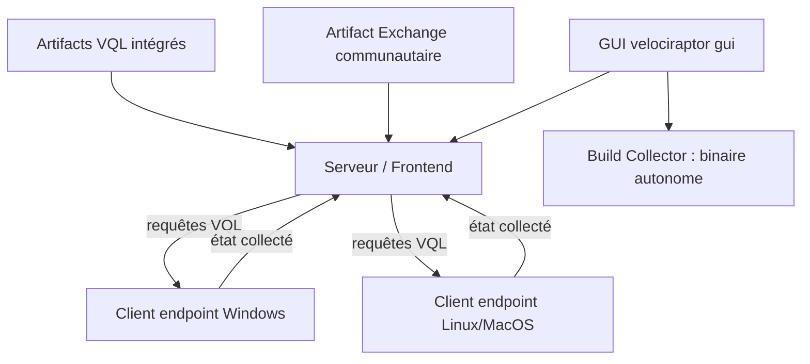

# Velocidex/velociraptor

> **Une phrase.** Interroger l'état des postes d'un parc avec un langage de requête dédié, depuis un serveur central.

## Le problème

Sans lui, récupérer l'état d'un poste suspect (fichiers, processus, journaux) se fait à la
main, machine par machine, avec des scripts jetables différents sur Windows, Linux et MacOS.

## Ce que ça fait vraiment

- Fournit VQL, « The Velociraptor Query Language », pour décrire ce qu'on veut collecter sur un hôte.
- Emballe ces requêtes en `Artifacts` : le binaire en embarque un jeu pour les cas courants.
- Expose une GUI qui lance en une commande le frontend, le serveur et un client local.
- Permet de fabriquer depuis la GUI un collecteur autonome (`Server Artifacts` → `Build Collector`), configuré avec les artefacts choisis, puis téléchargé.
- Se déploie soit en binaire unique par plateforme, soit en serveur via Docker, soit en outil de triage local.
- Ouvre un catalogue communautaire d'artefacts supplémentaires, l'Artifact Exchange.

## Comment c'est branché

Un serveur central, des clients sur les postes, et des artefacts VQL qui circulent dans un sens, les résultats dans l'autre.



## Essayer

```bash
  $ velociraptor gui
```

Pour bâtir depuis les sources (Go ≥ 1.23.2, gcc, make, Node.js LTS) :

```bash
    $ git clone https://github.com/Velocidex/velociraptor.git
    $ cd velociraptor
    $ cd gui/velociraptor/
    $ npm install
    $ make build
    $ cd ../..
    $ make
    $ make linux
    $ make windows
```

## Coût et pièges

Aucune clé d'API, aucun GPU, aucun service tiers : on télécharge un binaire depuis la page de
release et on le lance. Les coûts sont ailleurs : la compilation depuis les sources réclame Go
1.23.2 au minimum, gcc pour CGO, make et Node.js LTS, plus les outils mingw pour viser Windows
depuis Linux. Windows XP et Server 2003 ne sont pas supportés (limite de Go) ; les binaires
Linux 32 bits ne sont pas distribués, il faut les construire soi-même. Le README ne documente
ni le dimensionnement du serveur, ni le coût d'exploitation d'un déploiement réel, qui est
renvoyé vers la documentation externe.

## Ce que ce n'est pas

Ce n'est pas un antivirus ni un EDR qui bloque : il collecte et interroge l'état des hôtes, le
README ne mentionne aucune capacité de remédiation. Ce n'est pas non plus un outil qu'on pilote
sans apprentissage : l'éditeur propose un cours complet de sept sessions de deux heures, ce qui
situe la marche à franchir sur VQL. Enfin la GUI de démarrage rapide n'est pas un déploiement :
elle lance serveur et client sur la même machine, le vrai déploiement est un chapitre à part.

## Alternatives

Aucune alternative comparable dans le catalogue : les voisins proposés couvrent d'autres
terrains (bytebase/bytebase gère des schémas de bases de données, chaitin/SafeLine est un WAF
en frontal web, josh0xA/darkdump un moteur de recherche sur le dark web, lionsoul2014/ip2region
une base de géolocalisation d'IP). Aucun ne fait de la collecte d'état sur un parc de postes.

## Pour toi

Hors périmètre data/IA au sens strict, mais c'est le canal d'acquisition idéal si tu dois bâtir
un jeu de données de télémétrie de postes : VQL te donne des collectes reproductibles et
versionnables plutôt que des exports manuels. À surveiller si tu touches à la sécurité, à
ignorer sinon.
