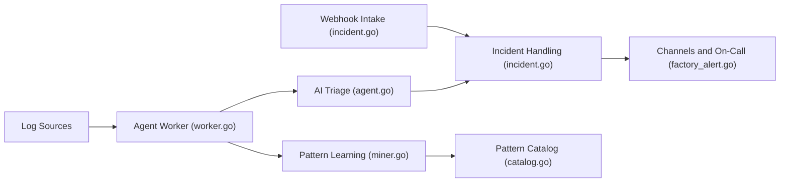

# VersusControl/versus-incident

> Agent SRE auto-hébergé qui apprend vos logs et n'escalade que les anomalies nouvelles, avec notifications et astreinte.

## Le problème
Maintenir des règles d'alerte fatigue les équipes ; on veut être prévenu seulement d'une erreur nouvelle ou inattendue.

## Ce que ça fait vraiment
Service Go avec tableau de bord. Deux sources d'incidents : des alertes par webhook (Alertmanager, Grafana, Sentry, CloudWatch SNS…) ou l'agent SRE qui lit des logs (fichier, Elasticsearch), apprend des motifs et passe par trois modes (`training`, `shadow`, `detect`). Les incidents sont mis en forme par gabarits Go, diffusés (Slack, Teams, Telegram, Viber, e-mail, Lark) et escaladés (PagerDuty, AWS Incident Manager). Redis mémorise la position dans chaque source.

## Comment c'est branché


## Essayer
```bash
docker run -d --name versus-redis -p 6379:6379 redis:7
docker run -p 3000:3000 -e GATEWAY_SECRET=change-me -e AGENT_ENABLE=true -e AGENT_MODE=training -e REDIS_HOST=host.docker.internal -e REDIS_PORT=6379 -v $(pwd)/config:/app/config -v $(pwd)/data:/app/data ghcr.io/versuscontrol/versus-incident
```

## Coût et pièges
Gratuit sous MIT ; une offre « Enterprise Pricing » existe (contenu non détaillé). Redis est requis pour l'agent et l'astreinte. Le README ne nomme pas le modèle utilisé pour le triage (non documenté). Le stockage fichier est le seul backend implémenté.

## Ce que ce n'est pas
Ce n'est pas un outil de supervision de métriques ; il travaille sur les logs et les webhooks. Le mode `detect` est activé après une phase d'apprentissage à surveiller.

## Alternatives
Aucune alternative nommée dans le README.

## Pour toi
À surveiller : l'idée du mode `shadow` avant d'alerter est sensée pour un profil MLOps qui veut du triage de logs, mais le fournisseur de LLM n'est pas précisé dans le README.

