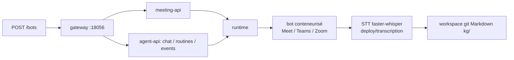

# Vexa-ai/vexa

> Bots de réunion open source et transcription temps réel, auto-hébergeables, pour équipes soucieuses de leurs données.

## Le problème
Les outils de réunion IA envoient les conversations dans leur cloud et te revendent l'accès.
Les outils « chat avec tes documents » démarrent après la transcription : personne ne la produit.

## Ce que ça fait vraiment
Un bot rejoint Google Meet, Teams et Zoom (Jitsi validé hors ligne) et diffuse en direct des
transcriptions attribuées par locuteur. Les réunions se compilent en Markdown dans un dépôt git
(bundle Open Knowledge Format `kg/`) que des agents de code lisent et écrivent comme un codebase.
Le runtime lance chaque bot et chaque agent dans son conteneur isolé, éphémère, sans egress hors
outils courtiers : backends `docker`, `process` ou `k8s` (un Pod par dispatch, chart Helm fourni).
Quatre déclencheurs d'agent : chat, cron, événement, fin de réunion. Les entrées non fiables tournent
en mode « propose-only » : l'agent suggère, un humain approuve.

## Comment c'est branché


## Essayer
```bash
git clone https://github.com/Vexa-ai/vexa.git && cd vexa
make all
make lite
make probe
curl -X POST "$API_BASE/bots" -H "X-API-Key: $API_KEY" -H "Content-Type: application/json" -d '{"platform":"google_meet","native_meeting_id":"abc-defg-hij","bot_name":"Vexa"}'
```

## Coût et pièges
Apache-2.0. Le service hébergé donne 2 $ de crédit, puis 0,30 $/h de bot. En auto-hébergé, la
transcription est une unité GPU séparée : sans STT, `POST /bots` répond 503 (sauf opt-out explicite).
`make dev` demande 8 vCPU et 16 Go. Un point de conformité : en multi-utilisateur, les tours des
autres doivent passer par une clé d'API, jamais par un abonnement personnel.

## Ce que ce n'est pas
Ce n'est pas encore complet : `PUT /bots/{…}/config`, `POST /bots/{…}/speak`, le streaming WebSocket
et `POST /agent/meeting/{start,process}` renvoient 404 dans l'open core en 0.12.
Ce n'est pas un modèle : Vexa n'exécute aucun LLM pendant la réunion, c'est ton agent.
Ce n'est pas un outil de RAG documentaire — il produit la matière que ces outils consomment.

## Alternatives
Recall.ai, API hébergée mais dans leur cloud ; Attendee, l'autre API de bots, sous Elastic License 2.0
qui interdit de la fournir en service managé ; le DIY Whisper + bot maison.

## Pour toi
Le candidat sérieux si tu dois des notes de réunion sans cloud tiers : commence par la transcription seule.
