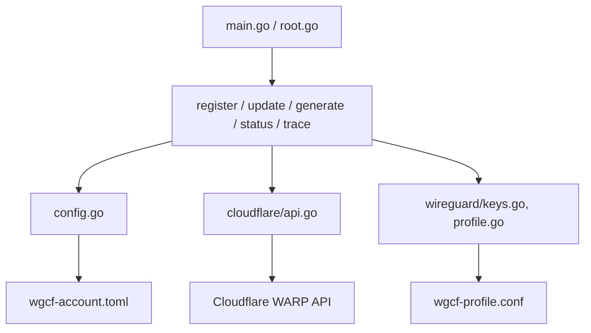

# ViRb3/wgcf

> CLI non officielle en Go qui enregistre un compte Cloudflare Warp et produit un profil WireGuard.

## Le problème
Utiliser Warp avec un client WireGuard standard exige des identifiants que seule l'application officielle sait obtenir.

## Ce que ça fait vraiment
- `register` crée un compte Warp et le sauvegarde dans `wgcf-account.toml`.
- `generate` écrit `wgcf-profile.conf` (MTU 1280 par défaut, keepalive optionnel).
- `update` change la clé de licence (abonnement Warp+), `status` affiche l'état du compte, `trace` vérifie `warp=on` ou `warp=plus`.
- Le client d'API est généré depuis `openapi-spec.yml`.

## Comment c'est branché


## Essayer
```bash
wgcf register
wgcf generate
wgcf generate --keepalive=60
wgcf status
wgcf trace
```

## Coût et pièges
Gratuit ; dépend de l'API Cloudflare et de ses conditions d'usage. Un bug connu peut afficher `warp=on` malgré une clé Warp+.

## Ce que ce n'est pas
Pas un produit Cloudflare : le README précise l'absence d'affiliation. Ce n'est pas un VPN clé en main, seulement un générateur de configuration ; le comportement peut casser si l'API change.

## Alternatives
- Client officiel Cloudflare Warp : pris en charge, mais sans profil WireGuard exportable.

## Pour toi
Surveiller : pratique pour un accès WireGuard sortant, sans rapport direct avec un flux data/IA, et dépendant d'un service tiers non garanti.

