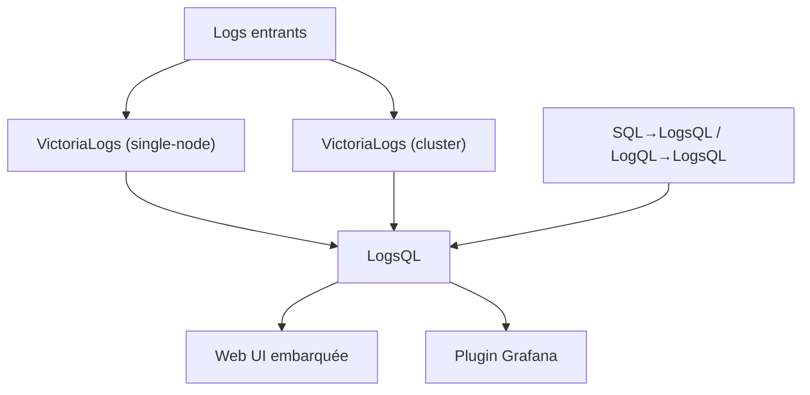

# VictoriaMetrics/VictoriaLogs

> Base de données de logs sans schéma et sans configuration, du petit setup au téraoctet par jour.

## Le problème
Stocker et interroger des logs à grande échelle impose en général un schéma, un tuning
d'indexation et une facture qui grimpe avec le volume.

## Ce que ça fait vraiment
Le README est très court. Il annonce une base de données de logs performante, légère, sans
configuration et sans schéma, qui monte verticalement et horizontalement. Deux formes de
déploiement existent — nœud unique et version cluster — les deux open source et gratuites. Un
langage de requête maison, LogsQL, est sous-entendu par la présence de convertisseurs
« SQL to LogsQL » et « LogQL to LogsQL » dans les playgrounds. Une UI web est embarquée et un
plugin Grafana est fourni.

## Comment c'est branché

## Essayer
Aucune commande n'est documentée dans ce README : il liste des liens (binaires de release,
images Docker sur Docker Hub et Quay, code source, documentation, CHANGELOG, guide de mise à
niveau).

## Coût et pièges
Gratuit dans les deux variantes. Le README ne dit rien des ressources nécessaires, de la
rétention, ni d'une éventuelle offre commerciale — VictoriaMetrics est une entreprise, donc
vérifier ce point avant de s'engager.

## Ce que ce n'est pas
Ce n'est pas VictoriaMetrics (métriques) : c'est le produit logs de la même maison. Ce n'est
pas une stack complète d'observabilité — pas d'agent de collecte décrit ici, pas d'alerting
mentionné. Le README ne suffit pas à juger : matière insuffisante.

## Alternatives
- Le README ne nomme aucune alternative ; il mentionne seulement LogQL (Loki) et SQL comme
  langages sources de conversion.

## Pour toi
À tester si ta facture Loki ou Elastic pique ; à confirmer sur la documentation, pas sur ce README.
