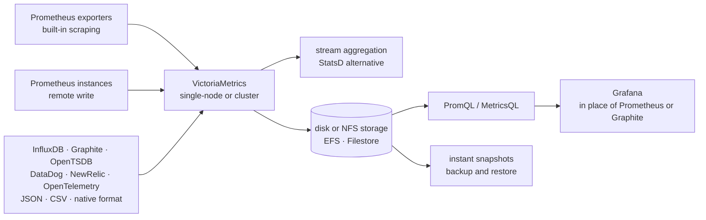

# VictoriaMetrics/VictoriaMetrics

> **A Go time series database, self-hosted, standing in for Prometheus or holding its long-term history.**

## The problem

Prometheus keeps its data locally and for a short window: past a few weeks, or a few million
active series, RAM and disk become the limiting factor, and history has to move to an extra
storage tier (Thanos, Cortex, M3DB) that must itself be installed, operated and watched.
Without that, you query N separate Prometheus instances with no global view, and pay a storage
bill that scales with retention.

## What it actually does

VictoriaMetrics is a time series database shipped in two shapes, both under Apache 2.0
according to the README: a **single-node** version (one binary, no dependencies, configured
through command-line flags) and a **cluster** version. It sits behind Prometheus as long-term
storage, or replaces it outright, and plugs into Grafana as a drop-in data source for
Prometheus or Graphite.

On the query side it accepts PromQL and exposes MetricsQL, its own dialect that the README
describes as more performant. On the write side it scrapes Prometheus exporters itself and
accepts ingestion and backfilling over an explicitly listed set of protocols: Prometheus remote
write and exposition format, InfluxDB line protocol (HTTP, TCP, UDP), Graphite plaintext with
tags, OpenTSDB (telnet and `/api/put`), JSON line format, arbitrary CSV, native binary format,
DataDog agent / DogStatsD, NewRelic infrastructure agent, and OpenTelemetry metrics.

Two capabilities go beyond storage: **stream aggregation**, presented as a StatsD alternative,
and the **global query view** — several Prometheus instances or other sources write into one
instance and are read through a single query. Alongside these: backup and restore through
instant snapshots, metrics relabeling, a cardinality limiter, and support for NFS-based storage
such as Amazon EFS or Google Filestore.

## How it is wired



No code-derived diagram exists for this repository: the graph above is reconstructed from the
README alone, so it names no source files. The point to keep is that one component holds all
three roles — collection, storage, querying — where a Prometheus plus Thanos stack splits them
across several processes.

## Trying it

```
No installation or startup command is written in the README.
```

The README contains no code block. For getting started it points to the "quick start guide" and
"key concepts" pages on `docs.victoriametrics.com`, and lists three distribution channels:
binary releases from the GitHub Releases page, Docker images on Docker Hub
(`victoriametrics/victoria-metrics`) and on Quay, and the source code. Nothing is reconstructed
here: the exact command belongs to the online documentation.

## Cost and pitfalls

- **The core is free, the Enterprise version is not.** The README draws the line clearly:
  single-node and cluster are Apache 2.0, but anomaly detection, backup automation, multiple
  retentions, downsampling, long-term support (LTS) release lines and core-team support belong
  to a commercial offering, with a free trial licence and then a contract. That is the reason
  for the alert: several of the features that shrink the storage bill sit behind payment.
- **No installation prerequisites announced**: the README claims no dependencies and a single
  binary, configured through command-line flags, with defaults already tuned. The cost is not
  at install time.
- **The real cost is operating it**: this is a database you host. Sizing RAM, disk, retention
  and cardinality stays with your team, and the README itself makes cardinality a topic
  (cardinality limiter, high-rate churn of old series).
- **Fast-moving project**, says the README, which points to the CHANGELOG and a dedicated "how
  to upgrade" page: version bumps need reading before applying.
- **Two topologies to choose up front**: single-node or cluster, documented separately. The
  README claims a single node can replace medium-sized clusters built on Thanos, M3DB, Cortex,
  InfluxDB or TimescaleDB — that is the project's own claim, not an independent measurement.
- **The performance figures are the project's own**: the comparisons (10x less RAM than
  InfluxDB, 7x less than Prometheus/Thanos/Cortex, 70x more data points than TimescaleDB) all
  link to posts by the author or to case studies on the vendor site. Check them against your
  own workload.

## What it is not

- **It is not a complete alerting system on its own**: the README covers storage, ingestion and
  querying, and mentions anomaly detection only as an Enterprise feature. Alerting rules and
  their routing are not described here.
- **It is not a managed service**: nothing is hosted for you in this repository. It is a binary
  or an image you run, back up and upgrade yourself. The vendor separately sells support and an
  Enterprise version, which is a different thing.
- **It is not a Grafana replacement or a visualisation tool**: it sits as a data source behind
  Grafana; the display stays elsewhere.
- **It is not a general-purpose database**: it is optimised for time series, including
  fast-churning ones. Relational data or logs are not the target — the project keeps a separate
  repository for logs.
- **It is not a commitment-free adoption**: MetricsQL is the project's own dialect, and queries
  written in it are not portable back to Prometheus.

## Alternatives

| | When to pick it instead |
|---|---|
| **prometheus/prometheus** | The direct comparison, named throughout the README. Stick with it while retention is short and volume fits one instance: fewer moving parts, the reference ecosystem. VictoriaMetrics takes over when history or cardinality become the problem. |
| **VictoriaMetrics/VictoriaLogs** | Same vendor, different material: logs. Not an alternative but the complement — take it when the need is searching text, not aggregating numeric series. |
| **netdata/netdata** | A catalogue neighbour, aimed at per-machine real-time collection and dashboards with its own UI. Prefer it for turnkey monitoring rather than a storage tier plugged behind an existing Prometheus. |

The remaining neighbour, `kubernetes/kube-state-metrics`, is not comparable: it is an exporter
of Kubernetes object metrics, so a possible upstream data source, not a competing database.

## For you

Worth adopting if you already run Prometheus metrics and retention or the storage bill is
starting to hurt: it is the option that collapses the most moving parts into one, with nothing
to install alongside. For a data / MLOps profile the interest goes beyond infrastructure
monitoring — it is a credible place to dump training, model-serving or drift metrics over
OpenTelemetry or remote write, with long history and a single query across sources. Skip it if
you want a managed service with no operations, or if the features you actually need
(downsampling, multiple retentions) are exactly the ones in the paid tier.
