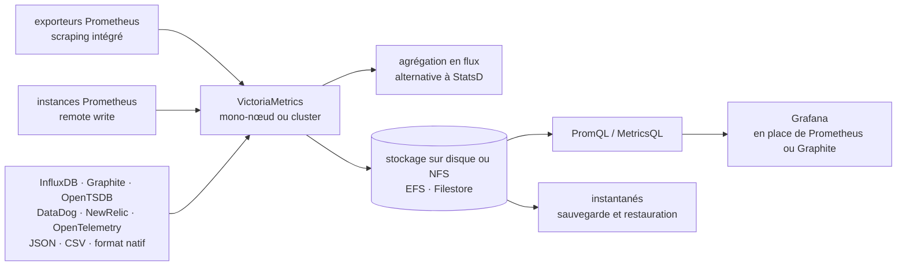

# VictoriaMetrics/VictoriaMetrics

> **Base de séries temporelles en Go, remplaçante ou stockage long terme de Prometheus, à héberger soi-même.**

## Le problème

Prometheus garde ses données localement et sur une durée courte : passé quelques semaines, ou
passé quelques millions de séries actives, la RAM et le disque deviennent le facteur limitant,
et l'historique part vers un étage de stockage supplémentaire (Thanos, Cortex, M3DB) qu'il faut
installer, exploiter et surveiller à son tour. Sans cela, on interroge N instances Prometheus
séparément, sans vue globale, et on paie une facture de stockage proportionnelle.

## Ce que ça fait vraiment

VictoriaMetrics est une base de données de séries temporelles distribuée en deux formes, toutes
deux sous Apache 2.0 selon le README : une version **mono-nœud** (un binaire, pas de dépendance,
configuration par options de ligne de commande) et une version **cluster**. Elle se met derrière
Prometheus comme stockage long terme, ou le remplace entièrement, et se branche comme source de
données Grafana à la place de Prometheus ou de Graphite.

Côté requêtes, elle accepte PromQL et expose MetricsQL, son propre dialecte que le README
présente comme plus performant. Côté écriture, elle fait elle-même le *scraping* d'exporteurs
Prometheus et accepte l'ingestion et le rattrapage d'historique dans une liste de protocoles
explicitement énumérée : Prometheus remote write et format d'exposition, ligne InfluxDB
(HTTP, TCP, UDP), Graphite texte avec tags, OpenTSDB (telnet et `/api/put`), JSON ligne, CSV
arbitraire, format binaire natif, agent DataDog / DogStatsD, agent NewRelic, métriques
OpenTelemetry.

Deux fonctions dépassent le simple stockage : l'**agrégation en flux**, présentée comme une
alternative à StatsD, et la **vue globale de requête** — plusieurs Prometheus ou d'autres
sources écrivent dans la même instance et se lisent en une seule requête. S'ajoutent des
sauvegardes et restaurations par instantanés, le *relabeling* de métriques, un limiteur de
cardinalité, et la prise en charge de stockages NFS type Amazon EFS ou Google Filestore.

## Comment c'est branché



Aucun diagramme tiré du code n'existe pour ce dépôt : ce schéma est reconstruit depuis le seul
README, et ne nomme donc aucun fichier source. Le point à retenir est que le même composant
tient les trois rôles — collecte, stockage, requête — là où une pile Prometheus plus Thanos les
répartit entre plusieurs processus.

## Essayer

```
Aucune commande d'installation ou de démarrage n'est écrite dans le README.
```

Le README ne contient aucun bloc de code. Il renvoie, pour la mise en route, au « quick start
guide » et aux « key concepts » de `docs.victoriametrics.com`, et indique trois voies de
distribution : les *binary releases* de la page GitHub Releases, les images Docker sur Docker
Hub (`victoriametrics/victoria-metrics`) et sur Quay, et le code source. Rien n'est reconstruit
ici : la commande exacte est à prendre dans la documentation en ligne.

## Coût et pièges

- **Le cœur est gratuit, la version Enterprise ne l'est pas.** Le README sépare nettement les
  deux : mono-nœud et cluster sont sous Apache 2.0, mais l'anomaly detection, l'automatisation
  des sauvegardes, les rétentions multiples, le *downsampling*, les lignes de support long terme
  (LTS) et le support du cœur d'équipe relèvent d'une offre commerciale, avec licence d'essai
  gratuite puis contrat. C'est la raison de l'alerte : plusieurs des fonctions qui font baisser
  la facture de stockage sont derrière le paiement.
- **Aucun prérequis d'installation annoncé** : le README revendique l'absence de dépendances et
  un binaire unique, configuré par options de ligne de commande, avec des valeurs par défaut
  déjà réglées. Le coût n'est donc pas à l'installation.
- **Le coût réel est l'exploitation** : c'est une base de données que l'on héberge. Dimensionner
  RAM, disque, rétention et cardinalité reste à la charge de l'équipe, et le README lui-même
  fait de la cardinalité un sujet (limiteur de cardinalité, remplacement rapide d'anciennes
  séries).
- **Projet à évolution rapide**, écrit le README, qui renvoie au CHANGELOG et à une page « how to
  upgrade » dédiée : les montées de version demandent une lecture avant application.
- **Deux topologies à choisir d'emblée** : mono-nœud ou cluster, documentées séparément. Le
  README affirme qu'un mono-nœud peut remplacer des clusters de taille moyenne bâtis sur Thanos,
  M3DB, Cortex, InfluxDB ou TimescaleDB — c'est une revendication du projet, pas une mesure
  indépendante.
- **Les chiffres de performance sont ceux du projet** : les comparaisons (10x moins de RAM
  qu'InfluxDB, 7x moins que Prometheus/Thanos/Cortex, 70x plus de points que TimescaleDB) pointent
  toutes vers des billets publiés par l'auteur ou vers les études de cas du site. À vérifier sur
  sa propre charge.

## Ce que ce n'est pas

- **Ce n'est pas un système d'alerting complet à lui seul** : le README parle de stockage,
  d'ingestion et de requête, et ne présente l'anomaly detection que comme fonction Enterprise.
  Les règles d'alerte et leur acheminement ne sont pas décrits ici.
- **Ce n'est pas un service géré** : rien n'est hébergé pour vous dans ce dépôt. C'est un binaire
  ou une image à faire tourner, à sauvegarder et à mettre à jour soi-même. L'éditeur vend par
  ailleurs du support et une version Enterprise, ce qui est autre chose.
- **Ce n'est pas un remplaçant de Grafana ni un outil de visualisation** : il se place comme
  source de données derrière Grafana, l'affichage reste ailleurs.
- **Ce n'est pas une base généraliste** : elle est optimisée pour des séries temporelles, y
  compris au renouvellement rapide. Y mettre des données relationnelles ou des logs n'est pas
  le sujet — le projet a un dépôt distinct pour les logs.
- **Ce n'est pas une adoption sans engagement de format** : MetricsQL est un dialecte propre au
  projet ; les requêtes qui s'en servent ne sont pas portables vers Prometheus.

## Alternatives

| | Quand le préférer |
|---|---|
| **prometheus/prometheus** | Le point de comparaison direct, nommé partout dans le README. À préférer tant que la rétention est courte et le volume tenable sur une instance : moins de pièces, écosystème de référence. VictoriaMetrics prend le relais quand l'historique ou la cardinalité deviennent le problème. |
| **VictoriaMetrics/VictoriaLogs** | Même éditeur, autre matière : les logs. Ce n'est pas une alternative mais le complément — à prendre si le besoin est de chercher dans du texte, pas d'agréger des séries numériques. |
| **netdata/netdata** | Voisin du catalogue, orienté collecte et tableaux de bord temps réel par machine, avec sa propre interface. À préférer si l'on veut une supervision clés en main plutôt qu'un étage de stockage à brancher derrière un Prometheus existant. |

Le dernier voisin proposé, `kubernetes/kube-state-metrics`, n'est pas comparable : c'est un
exporteur de métriques d'objets Kubernetes, donc une source de données possible en amont, pas
une base concurrente.

## Pour toi

À adopter si l'on exploite déjà des métriques Prometheus et que la rétention ou la facture de
stockage commencent à peser : c'est l'option qui remplace le plus de pièces par une seule, sans
dépendance à installer. Pour un profil data / MLOps, l'intérêt dépasse la supervision
d'infrastructure — c'est un endroit crédible où déverser des métriques d'entraînement, de
service de modèles ou de dérive, via OpenTelemetry ou remote write, avec un historique long et
une seule requête sur plusieurs sources. À écarter si l'on cherche un service géré sans
exploitation, ou si les fonctions qui intéressent (downsampling, rétentions multiples) sont
justement celles de l'offre payante.
