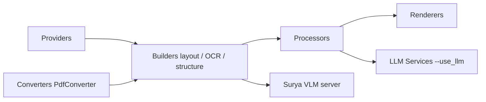

# VikParuchuri/marker

> Convertit PDF, images, Office, HTML et EPUB en Markdown, JSON, HTML ou chunks, pour pipelines de documents.

## Le problème
Extraire proprement texte, tableaux, formules et images d'un PDF pour un pipeline RAG ou d'analyse est fragile.

## Ce que ça fait vraiment
Marker lit le texte du PDF, détecte la mise en page, décide page par page si le texte est exploitable et confie les pages abîmées ou scannées, les équations et certains tableaux à un modèle de vision (surya) servi localement (vLLM en Docker sur GPU NVIDIA, llama.cpp ailleurs). Deux modes : `balanced` (GPU) et `fast` (CPU). L'option `--use_llm` ajoute un LLM externe. Sorties : Markdown, JSON, HTML, chunks.

## Comment c'est branché


## Essayer
```bash
pip install marker-pdf
pip install marker-pdf[full]
marker_single /path/to/file.pdf
marker /path/to/input/folder
marker_server --port 8001
```

## Coût et pièges
Code sous Apache 2.0 ; poids du modèle sous licence Open Rail-M modifiée, gratuite pour recherche, usage personnel et startups sous 5 M$, payante au-delà. `--use_llm` envoie les documents à un fournisseur tiers (Gemini par défaut) avec une clé à ta charge. Les chiffres de benchmark viennent de l'auteur.

## Ce que ce n'est pas
Pas un OCR pleine page de pointe : pour les scans et les maths, le README renvoie à Chandra ou surya. L'API serveur intégrée n'est pas robuste.

## Alternatives
- MinerU : cité, plus lent que Marker balanced mais proche en qualité (pipeline).
- docling : cité, moins bon score dans le benchmark de l'auteur.
- Chandra : modèle hébergé d'Datalab, plus précis.

## Pour toi
Adopter pour transformer des corpus PDF en Markdown ou chunks avant indexation, en vérifiant la licence des poids si l'usage est commercial.

