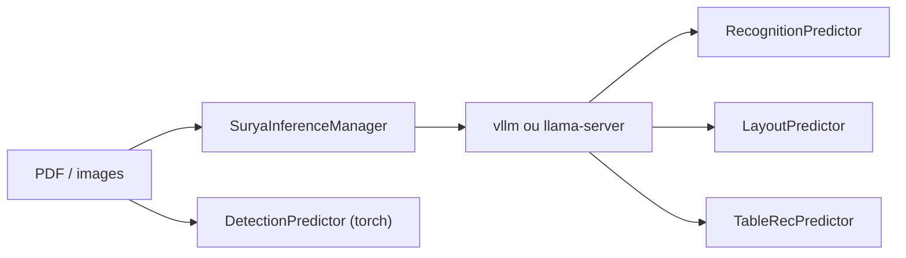

# VikParuchuri/surya

> Modèle OCR de 650 M de paramètres avec analyse de mise en page et tableaux, pour extraire du texte de documents.

Note : ce dépôt porte le même README que `datalab-to/surya` (même date de création, mêmes issues) ; c'est vraisemblablement l'ancien nom du même projet.

## Le problème
Extraire texte, mise en page, ordre de lecture, tableaux et formules de PDF et d'images dans de nombreuses langues, sans un modèle géant.

## Ce que ça fait vraiment
Surya 2 fait la mise en page, l'OCR (page entière ou par bloc) et la reconnaissance de tableaux avec un seul modèle vision-langage. Il tourne derrière un serveur `vllm` (GPU NVIDIA, via Docker) ou `llama.cpp` (CPU, Apple Silicon), lancé automatiquement. Un petit modèle torch sépare fait la détection de lignes. Les sorties sont des JSON avec `blocks`, `html`, `bbox`, `confidence`. Le README annonce 83,3 % sur olmOCR-bench et 5,35 pages/s sur RTX 5090 (mesures de l'auteur).

## Comment c'est branché


## Essayer
```bash
pip install surya-ocr
surya_ocr DATA_PATH
surya_layout DATA_PATH
surya_table DATA_PATH
surya_detect DATA_PATH
surya_gui
```

## Coût et pièges
Gratuit pour le code (Apache 2.0). Les poids suivent une licence AI Pubs Open Rail-M modifiée : gratuite pour la recherche, l'usage personnel et les startups sous 5 M$ ; au-delà, licence payante. Docker et NVIDIA Container Toolkit requis côté GPU ; `llama.cpp` sinon (0,108 page/s mesuré sur Apple Silicon).

## Ce que ce n'est pas
Pas fait pour les photos ou scènes naturelles. La détection seule marche sans serveur ; le reste exige un backend d'inférence en cours d'exécution.

## Alternatives
Chandra OCR 2 (même éditeur, plus précis), dots.mocr, LightOnOCR 2-1B, olmOCR et GOT OCR, cités dans le tableau du README.

## Pour toi
Adopter pour de l'extraction documentaire : petit modèle, bons scores annoncés ; vérifie d'abord la licence des poids si l'usage est commercial.

