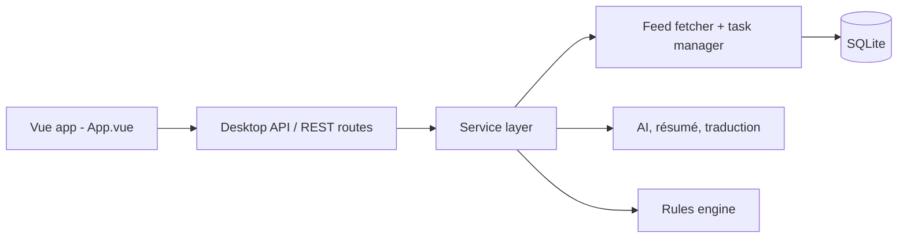

# WCY-dt/MrRSS

> Lecteur RSS multiplateforme avec traduction, résumés IA et règles d'automatisation, en application de bureau ou serveur.

## Le problème
Suivre beaucoup de flux (RSS, newsletters, scripts) sans outil pour filtrer, résumer et exporter vers ses notes.

## Ce que ça fait vraiment
Application Wails v3 (Go plus interface Vue) qui récupère des flux RSS/Atom, e-mails, XPath et scripts, les stocke dans SQLite et les affiche. Un moteur de règles applique filtres et actions. Résumé et traduction passent par un fournisseur IA au choix (OpenAI, Anthropic, Gemini, DeepSeek, Ollama d'après le code). Intégrations : FreshRSS, RSSHub, Notion, Zotero, SiYuan. Mode serveur sans interface par étiquette de build `server`, avec une API REST locale.

## Comment c'est branché


## Essayer
```bash
docker run -p 1234:1234 mrrss-server:latest
docker run -d -p 1234:1234 ghcr.io/devxdojo/mrrss:latest-amd64
go build -tags server -o mrrss-server .
```
Ou télécharger l'installeur depuis la page Releases.

## Coût et pièges
Les fonctions IA demandent la clé d'un fournisseur, facturée par lui (sauf modèle local). Compilation depuis les sources : Go, Node, Wails v3 en version bêta, dépendances GTK sous Linux.

## Ce que ce n'est pas
Ce n'est pas un service hébergé. Licence GPL-3.0 : les modifications redistribuées doivent rester sous la même licence.

## Alternatives
FreshRSS et RSSHub sont cités comme intégrations, pas comme substituts.

## Pour toi
À surveiller : utile pour une veille automatisée avec résumés IA, mais Wails v3 est en bêta et la GPL peut gêner un usage embarqué.

