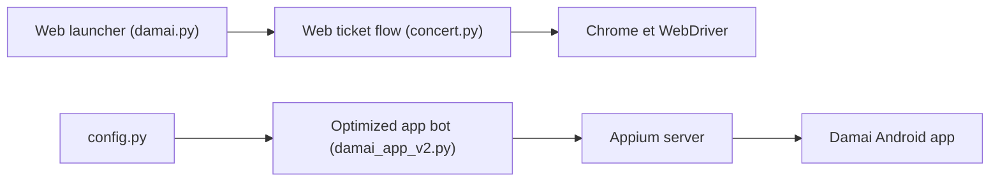

# WECENG/ticket-purchase

> Automatisation de l'achat de billets Damai par Selenium (web) et Appium (Android).

## Le problème
Les billets de concerts partent en secondes ; cliquer à la main est trop lent.

## Ce que ça fait vraiment
Deux scripts Python : Web (Selenium, `damai.py`, connexion et cookies, choix de ville, prix, spectateurs, soumission) et mobile (Appium + UiAutomator2, `damai_app_v2.py`). Configuration en JSON, tentatives automatiques. Le mobile est présenté comme l'option recommandée.

## Comment c'est branché


## Essayer
```bash
poetry install
appium --port 4723
cd damai_appium
python damai_app_v2.py
```

## Coût et pièges
Gratuit, mais exige Appium, SDK Android, Node 20.19+ et un appareil. Chemins personnels codés dans le README. Aucune licence ; usage « étude et recherche » seulement. README en chinois.

## Ce que ce n'est pas
Pas un outil garanti : risque de blocage du compte, et possible violation des conditions de la billetterie.

## Alternatives
Aucune nommée dans le README.

## Pour toi
À ignorer : sans licence, usage de revente douteux et hors périmètre data/IA.

