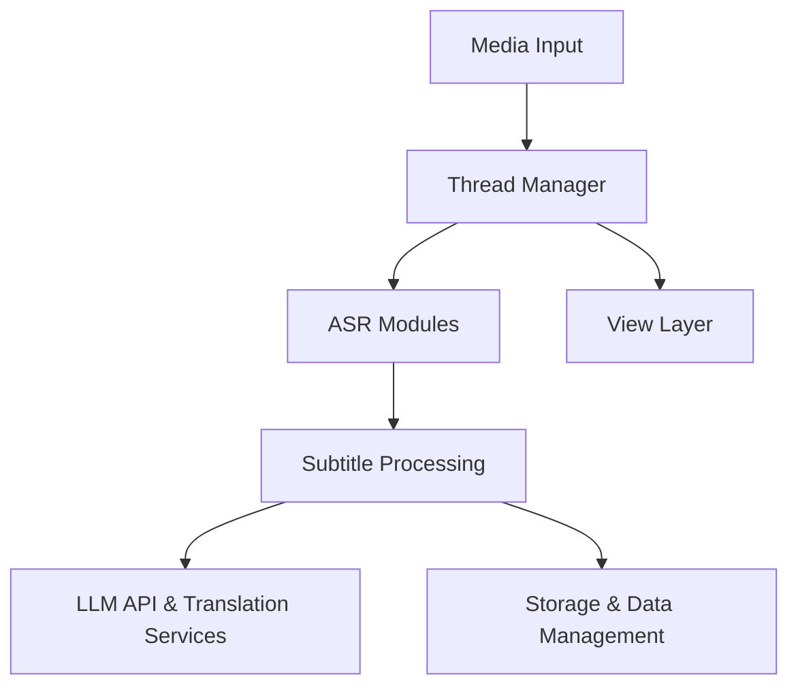

# WEIFENG2333/VideoCaptioner

> Chaîne complète de sous-titrage vidéo (CLI et GUI) : transcription, correction LLM, traduction, incrustation.

## Le problème
Obtenir des sous-titres propres et traduits oblige à enchaîner à la main un ASR, une correction du découpage et une traduction.

## Ce que ça fait vraiment
La transcription passe par faster-whisper, whisper-cpp, whisper-api ou les moteurs gratuits bijian et jianying.
Un LLM corrige le découpage en phrases, puis la traduction se fait via le LLM, Bing ou Google.
Il fait le doublage, incruste les sous-titres (ffmpeg) et télécharge depuis YouTube ou Bilibili.
Il fournit une commande `process` qui enchaîne tout, et un skill Claude Code.

## Comment c'est branché


## Essayer
```bash
pip install videocaptioner
videocaptioner transcribe video.mp4 --asr bijian
videocaptioner subtitle input.srt --translator bing --target-language en
videocaptioner process video.mp4 --target-language ja
videocaptioner config set llm.api_key <your-key>
```

## Coût et pièges
Les fonctions de base sont gratuites, mais les moteurs ASR gratuits (bijian, jianying) envoient l'audio à des services tiers. La clé LLM est à ta charge. Le code est sous GPL-3.0.

## Ce que ce n'est pas
Ce n'est pas un modèle ASR : il orchestre des modèles existants. La documentation est surtout en chinois.

## Alternatives
Le README ne nomme aucun dépôt alternatif.

## Pour toi
À surveiller : une CLI scriptable, utile pour préparer des corpus audio ou vidéo, mais privilégie faster-whisper en local pour les données sensibles.
