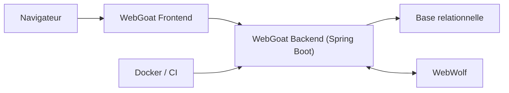

# WebGoat/WebGoat

> Application web volontairement vulnérable de l'OWASP pour apprendre la sécurité applicative par des exercices.

## Le problème
Apprendre à reconnaître et exploiter les failles web (injection SQL, JWT, etc.) demande un terrain d'essai sûr et légal.

## Ce que ça fait vraiment
Application Spring Boot proposant des leçons interactives sur des failles courantes, accompagnée de WebWolf, un service compagnon (e-mails, dépôt de fichiers, JWT) pour certains exercices. Une base relationnelle garde la progression. Des variables d'environnement permettent d'exclure des catégories ou des leçons.

## Comment c'est branché


## Essayer
```shell
docker run -it -p 127.0.0.1:8080:8080 -p 127.0.0.1:9090:9090 webgoat/webgoat
docker run -p 127.0.0.1:3000:3000 webgoat/webgoat-desktop
./mvnw spring-boot:run
```

## Coût et pièges
Gratuit. La machine devient très vulnérable : ne lier qu'à localhost. Certaines leçons demandent le bon fuseau horaire (`TZ`). Java 25 requis pour compiler.

## Ce que ce n'est pas
Ce n'est pas un outil de test d'intrusion : c'est la cible d'entraînement, à utiliser avec ZAP ou Burp. La licence est présente mais non reconnue par GitHub.

## Alternatives
Aucune alternative nommée dans le README.

## Pour toi
À surveiller : utile pour former une équipe à la sécurité applicative avant d'exposer des API de modèles, sans être un outil du quotidien.

