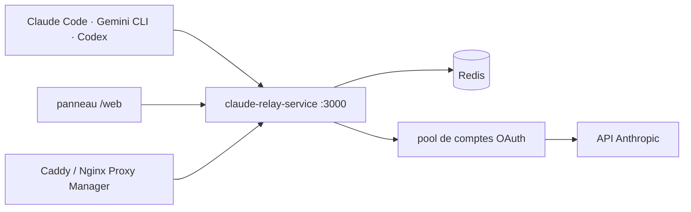

# Wei-Shaw/claude-relay-service

> Service de relais Claude API auto-hébergé, avec gestion multi-comptes et clés par utilisateur.

## Le problème
Dans certaines régions l'accès direct à Claude Code est impossible, et les miroirs tiers voient
passer tout le contenu des conversations.

## Ce que ça fait vraiment
Un service Node.js + Redis qui relaie les requêtes vers l'API Anthropic depuis ton propre serveur.
Il gère plusieurs comptes Claude avec rotation automatique et bascule en cas de problème, des clés
d'API individuelles par utilisateur, des statistiques de tokens et de coût par personne, un panneau
web de supervision, des limites de débit, de concurrence, de modèles et de clients (par User-Agent),
et le support des proxys HTTP/SOCKS5. Des routes distinctes exposent les pools Claude, Antigravity,
Gemini, Codex et Droid.

## Comment c'est branché


## Essayer
```bash
curl -fsSL https://pincc.ai/manage.sh -o manage.sh && chmod +x manage.sh && ./manage.sh install
crs start
```
```bash
export ANTHROPIC_BASE_URL="http://127.0.0.1:3000/api/"
export ANTHROPIC_AUTH_TOKEN="clé créée dans le panneau"
```

## Coût et pièges
Le README prévient en tête : **l'usage de ce projet peut violer les conditions de service
d'Anthropic**, et tout risque — bannissement de compte, interruption de service, autre perte — est
à la charge de l'utilisateur. Les versions ≤ v1.1.248 comportent une faille critique de
contournement d'authentification administrateur permettant un accès non autorisé au panneau. Le
script d'installation s'exécute par `curl | bash` depuis un domaine tiers (`pincc.ai`). Node 18+,
Redis 6+, serveur hors de Chine recommandé.

## Ce que ce n'est pas
Ce n'est pas un service officiel ni approuvé : le README le présente comme destiné à
l'apprentissage technique et à la recherche. Ce n'est pas non plus gratuit à l'usage — il faut un
ou plusieurs abonnements Claude Max à partager, plus un serveur.

## Alternatives
Le README pointe vers CRS 2.0 (sub2api), « projet de nouvelle génération » vers lequel migrer, et
mentionne Claude Code Plus comme plugin IntelliJ.

## Pour toi
Le partage de compte contraire aux conditions de service et l'historique de faille d'authentification
disqualifient l'outil en contexte professionnel.
