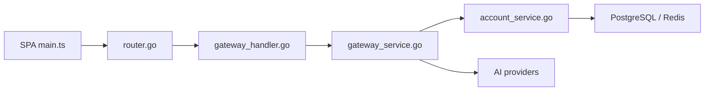

# Wei-Shaw/sub2api

> Passerelle API qui revend le quota d'abonnements IA sous forme de clés API, pour opérateurs.

## Le problème
Mutualiser des abonnements (Claude, Codex, Grok…) entre plusieurs utilisateurs avec facturation et limites.

## Ce que ça fait vraiment
Backend Go (Gin, Ent) + console Vue : gestion de comptes amont (OAuth, clé API), génération de clés, ordonnancement avec sessions collantes et bascule, limites de débit et de concurrence, facturation au token, paiement intégré (Alipay, WeChat Pay, Stripe…). Adaptateurs OpenAI, Anthropic, Gemini, Bedrock, Antigravity. PostgreSQL + Redis.

## Comment c'est branché


## Essayer
```bash
curl -sSL https://raw.githubusercontent.com/Wei-Shaw/sub2api/main/deploy/docker-deploy.sh | bash
docker compose up -d
docker compose logs -f sub2api
```

## Coût et pièges
Le README avertit : l'usage peut violer les conditions d'Anthropic et d'autres fournisseurs ; risque de bannissement de comptes à ta charge. 3 332 issues ouvertes.

## Ce que ce n'est pas
Pas une passerelle LLM d'entreprise conforme ; c'est un outil de partage de quotas grand public.

## Alternatives
Aucune nommée (sub2api-mobile est un complément).

## Pour toi
Risque contractuel trop élevé pour un usage pro : à ignorer.
