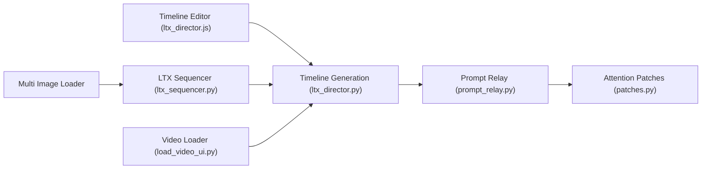

# WhatDreamsCost/WhatDreamsCost-ComfyUI

> Nœuds ComfyUI dont un éditeur de timeline pour la génération vidéo LTX, destinés aux créateurs de vidéo IA.

## Le problème
Composer des vidéos LTX avec images-clés, prompts par segment et audio demande de bricoler de nombreux nœuds sans vue d'ensemble temporelle.

## Ce que ça fait vraiment
- « LTX Director 2.0 » : timeline avec prompts, images de début/milieu/fin, audio, vidéo, IC-LoRA, relais de prompt.
- Nœuds annexes : chargeur multi-images, LTX Sequencer, LTX Keyframer, calcul de durée de parole, chargement vidéo/audio avec découpe.
- Le mode Retake est signalé comme bêta, jugé « pas assez puissant » par l'auteur.
- L'auteur dit avoir surtout utilisé Gemini pour écrire les nœuds.

## Comment c'est branché


## Essayer
```bash
cd /ComfyUI/custom_nodes/
git clone https://github.com/WhatDreamscost/WhatDreamsCost-ComfyUI
```
Ou via ComfyUI Manager ; mettre à jour ComfyUI-LTXVideo et ComfyUI-KJNodes.

## Coût et pièges
GPU requis pour générer. Le chargeur vidéo consomme beaucoup de RAM sur de longues sorties. 114 issues ouvertes. Documentation « bientôt ».

## Ce que ce n'est pas
Pas un modèle ni un service : uniquement des nœuds, dépendants de ComfyUI-LTXVideo. Tutoriels et documentation non terminés.

## Alternatives
Aucune alternative nommée dans le README.

## Pour toi
À surveiller : utile seulement si tu fais de la génération vidéo LTX dans ComfyUI ; projet jeune, mono-mainteneur et encore en mouvement.

