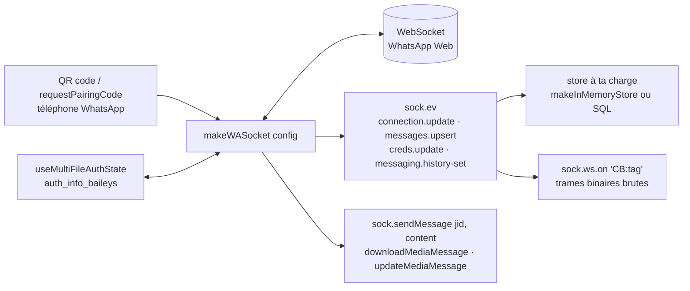

# WhiskeySockets/Baileys

> **A TypeScript library that speaks the WhatsApp Web protocol over WebSocket, with no browser.**

## The problem

Automating WhatsApp usually means driving a browser: Selenium or Chromium kept open to click
through WhatsApp Web. The README puts a number on that approach — it costs "like **half a
gig**" of RAM per session — and it stays brittle, tied to how the page renders. The other
route, the official WhatsApp Business API, means going through a commercial process.

## What it actually does

Baileys opens the WhatsApp Web WebSocket directly and implements the binary protocol on the
client side, without a browser and without Selenium. It supports the multi-device and web
versions of WhatsApp: a session is created by authenticating as a second client, either with a
QR code printed in the terminal (`printQRInTerminal: true`) or with a pairing code
(`sock.requestPairingCode(number)`).

The single entry point is `makeWASocket(config)`. It returns an object that emits events in
`EventEmitter` style — `connection.update`, `messages.upsert`, `messages.update`,
`creds.update`, `messaging.history-set`, `groups.update`, `group-participants.update` — and
exposes the actions. Sending goes through one function, `sock.sendMessage(jid, content,
options)`, covering text, quotes, mentions, forwards, location, contact cards, reactions,
pinning, polls, images, video, audio, gifs (sent as `.mp4` with `gifPlayback`) and `viewOnce`
content. Then come editing (`delete`, `edit`), media download (`downloadMediaMessage` as
`stream` or `buffer`), re-upload of expired media (`sock.updateMediaMessage`), call rejection
(`sock.rejectCall`), read receipts and presence, chat archiving and muting, some thirty group
operations (creation, admins, subject, description, invite links, join requests), privacy
settings, broadcast lists and stories.

Authentication state is the caller's responsibility:
`useMultiFileAuthState('auth_info_baileys')` ships as a helper and as a template to port to a
SQL or NoSQL store. The README is insistent: Signal keys change on every message sent or
received and must be persisted, otherwise messages stop reaching recipients. Finally
`sock.ws.on('CB:<tag>')` gives access to raw binary frames (`tag`, `attrs`, `content`) so you
can write your own extensions instead of forking.

## How it is wired



No code-derived diagram exists for this repository: the graph above is reconstructed from the
README alone. What it shows is that everything flows through a single socket object, and that
two pieces stay outside the library — credential persistence and chat storage.

## Trying it

```
yarn add @whiskeysockets/baileys
```

Edge version, with no stability guarantee according to the README:

```
yarn add github:WhiskeySockets/Baileys
```

```ts
import makeWASocket from '@whiskeysockets/baileys'
```

To run the bundled example (`Example/example.ts`), the README gives three steps:

```
cd path/to/Baileys
yarn
yarn example
```

## Cost and traps

- **The library is free, the dependency is not**: it lives and dies with the WhatsApp Web
  protocol, which is not publicly documented and can change without notice. The README recalls
  that the original repository "had to be removed by the original author".
- **API break in 7.0.0**: a `CAUTION` box announces "multiple breaking changes" and points to a
  migration page. The README declares itself temporary and due to be replaced, and the API
  reference lives elsewhere (`baileys.wiki`).
- **You need a real WhatsApp number** and a phone to scan the QR code or confirm the pairing
  code — and the pairing code only connects one device.
- **Key handling is a documented trap**: failing to persist `authState.keys` on every update
  "will prevent your messages from reaching the recipient".
- **Optional dependencies you install yourself**: `link-preview-js` for link previews, `jimp`
  or `sharp` for image thumbnails, `ffmpeg` on the system for video thumbnails and audio
  conversion (`ffmpeg -i input.mp4 -avoid_negative_ts make_zero -ac 1 output.ogg`).
- **Memory cost of the default store**: the README advises against `makeInMemoryStore` —
  keeping a whole chat history in memory is "a terrible waste of RAM".
- **Account risk**: the project is neither affiliated with nor authorized by WhatsApp, the
  maintainers do not condone uses that violate its Terms of Service, and they explicitly
  discourage spam, bulk messaging and stalkerware. Responsibility is left to the user.
- **Paid support**: the maintainer, Rajeh, sells one-hour video slots and invites businesses to
  sponsor. The library stays MIT; the help around it does not.

## What it is not

- **It is not the official WhatsApp Business API** nor a WhatsApp-approved product: the README
  devotes a full section to disclaiming any affiliation.
- **It is not a ready-made bot**: there is no command router, no scheduler, no interface. You
  receive raw events and write everything else.
- **It is not a database**: "Baileys does not come with a defacto storage for chats, contacts,
  or messages". Chats, contacts, messages and credentials are yours to store, and `getMessage`
  — needed for message retries and poll-vote decryption — assumes that store already exists.
- **It is not a complete WhatsApp Web client**: marking a whole chat as read is impossible, you
  must track unread messages yourself; creating broadcast lists is unsupported on web, only
  deleting them works.
- **It is not a repository documented by this file**: the README states its own provisional
  status and sends the API reference to an external site.

## Alternatives

| | When to prefer it |
|---|---|
| **sigalor/whatsapp-web-reveng** | Credited in the README for its observations on how WhatsApp Web works. Something to read rather than install, when you want to understand the protocol before depending on an implementation. |
| **Rhymen/go-whatsapp** | Cited as the **go** implementation. Prefer it when the target stack is Go rather than Node. |
| **pokearaujo/multidevice** | Cited for its notes on WhatsApp Multi-Device: the source to check when Baileys surprises you on that part. |

The catalogue's suggested neighbours (`NodeBB/NodeBB`, `Kong/insomnia`,
`geektutu/7days-golang`, `schlagmichdoch/PairDrop`) are not comparable: a forum, an HTTP
client, a Go course and a peer-to-peer file transfer — the proximity comes from JavaScript
vocabulary, not from messaging.

## For you

Genuinely useful if a WhatsApp channel has to feed or return a pipeline — collecting messages
into a data flow, notifying on job completion, wiring a conversational agent to a model: this
is the most direct path in Node, with no browser to maintain. Watch it rather than adopt it,
because the dependency rests on a non-public protocol that can break, because the 7.0.0 break
and a self-declared temporary README signal a moving phase, and because the risk to the
account you use is yours to carry. Prototype on a dedicated number, never on someone's own.
