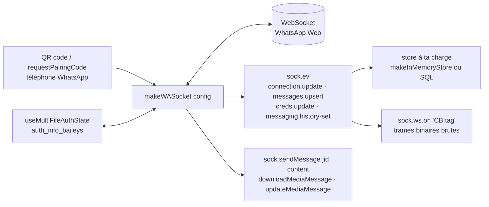

# WhiskeySockets/Baileys

> **Une bibliothèque TypeScript qui parle le protocole WhatsApp Web en WebSocket, sans navigateur.**

## Le problème

Automatiser WhatsApp passe d'ordinaire par le pilotage d'un navigateur : Selenium ou Chromium
tenus ouverts pour cliquer dans WhatsApp Web. Le README chiffre le coût de cette approche —
« like **half a gig** of ram » par session — et elle reste fragile, dépendante du rendu de la
page. L'autre voie, l'API WhatsApp Business officielle, suppose une démarche commerciale.

## Ce que ça fait vraiment

Baileys ouvre directement le WebSocket de WhatsApp Web et implémente le protocole binaire
côté client, sans navigateur ni Selenium. Il prend en charge les versions multi-appareils et
web de WhatsApp : la session se crée en s'authentifiant comme second client, par QR code
affiché dans le terminal (`printQRInTerminal: true`) ou par code d'appairage
(`sock.requestPairingCode(number)`).

Le point d'entrée unique est `makeWASocket(config)`. Il retourne un objet qui émet des
événements à la façon d'un `EventEmitter` — `connection.update`, `messages.upsert`,
`messages.update`, `creds.update`, `messaging.history-set`, `groups.update`,
`group-participants.update` — et expose les actions. L'envoi passe par une seule fonction,
`sock.sendMessage(jid, content, options)`, pour texte, citation, mention, transfert, position,
carte de contact, réaction, épinglage, sondage, image, vidéo, audio, gif (envoyé en `.mp4`
avec `gifPlayback`), message éphémère `viewOnce`. Suivent la modification (`delete`, `edit`),
le téléchargement de média (`downloadMediaMessage` en `stream` ou `buffer`), le ré-envoi de
média expiré (`sock.updateMediaMessage`), le refus d'appel (`sock.rejectCall`), les accusés de
lecture et la présence, l'archivage et la sourdine de conversations, une trentaine
d'opérations de groupe (création, admins, sujet, description, lien d'invitation, demandes
d'adhésion), les réglages de confidentialité, les listes de diffusion et les statuts.

L'état d'authentification est à la charge de l'appelant : `useMultiFileAuthState('auth_info_baileys')`
est fournie comme utilitaire et comme modèle à recopier vers une base SQL ou NoSQL. Le README
insiste : les clés Signal changent à chaque message reçu ou envoyé et doivent être persistées,
faute de quoi les messages n'arrivent plus. Enfin `sock.ws.on('CB:<tag>')` donne accès aux
trames binaires brutes (`tag`, `attrs`, `content`) pour écrire ses propres extensions plutôt
que de forker.

## Comment c'est branché



Aucun diagramme tiré du code n'existe pour ce dépôt : ce schéma est reconstruit depuis le seul
README. Ce qu'il montre, c'est que tout passe par un seul objet socket, et que deux pièces
restent hors bibliothèque — la persistance des identifiants et le stockage des conversations.

## Essayer

```
yarn add @whiskeysockets/baileys
```

Version de tête, sans garantie de stabilité selon le README :

```
yarn add github:WhiskeySockets/Baileys
```

```ts
import makeWASocket from '@whiskeysockets/baileys'
```

Pour faire tourner l'exemple fourni (`Example/example.ts`), le README donne trois étapes :

```
cd path/to/Baileys
yarn
yarn example
```

## Coût et pièges

- **La bibliothèque est gratuite, la dépendance ne l'est pas** : elle vit ou meurt avec le
  protocole WhatsApp Web, non documenté publiquement et modifiable sans préavis. Le README
  rappelle que le dépôt d'origine « had to be removed by the original author ».
- **Rupture d'API en 7.0.0** : un encadré `CAUTION` annonce « multiple breaking changes » et
  renvoie vers une page de migration. Le README lui-même se déclare temporaire, appelé à être
  remplacé, et la documentation de référence est ailleurs (`baileys.wiki`).
- **Il faut un numéro WhatsApp réel** et un téléphone pour scanner le QR code ou valider le
  code d'appairage — celui-ci ne permet qu'un seul appareil.
- **La gestion des clés est un piège documenté** : ne pas persister `authState.keys` à chaque
  mise à jour « will prevent your messages from reaching the recipient ».
- **Dépendances optionnelles à installer soi-même** : `link-preview-js` pour les aperçus de
  liens, `jimp` ou `sharp` pour les vignettes d'images, `ffmpeg` sur le système pour les
  vignettes vidéo et pour convertir l'audio (`ffmpeg -i input.mp4 -avoid_negative_ts make_zero -ac 1 output.ogg`).
- **Coût mémoire du store par défaut** : le README déconseille `makeInMemoryStore` — garder
  tout l'historique en mémoire est « a terrible waste of RAM ».
- **Risque de compte** : le projet n'est ni affilié ni autorisé par WhatsApp, les mainteneurs
  ne cautionnent pas les usages violant ses conditions d'utilisation et découragent
  explicitement le spam, l'envoi en masse et le stalkerware. La responsabilité est renvoyée à
  l'utilisateur.
- **Support payant** : le mainteneur, Rajeh, propose des créneaux de visioconférence payants et
  invite les entreprises à sponsoriser. La bibliothèque reste MIT, l'assistance ne l'est pas.

## Ce que ce n'est pas

- **Ce n'est pas l'API WhatsApp Business officielle** ni un produit approuvé par WhatsApp : le
  README consacre une section entière au démenti d'affiliation.
- **Ce n'est pas un bot prêt à l'emploi** : il n'y a ni gestionnaire de commandes, ni
  planificateur, ni interface. On reçoit des événements bruts et on écrit tout le reste.
- **Ce n'est pas une base de données** : « Baileys does not come with a defacto storage for
  chats, contacts, or messages ». Conversations, contacts, messages et identifiants sont à
  stocker par l'appelant, et `getMessage` — nécessaire aux renvois automatiques et au
  déchiffrement des votes de sondage — suppose ce store déjà écrit.
- **Ce n'est pas un client complet de WhatsApp Web** : marquer une conversation entière comme
  lue est impossible, il faut suivre soi-même les messages non lus ; la création de listes de
  diffusion n'est pas prise en charge côté web, seule leur suppression l'est.
- **Ce n'est pas un projet documenté dans ce fichier** : le README affiche lui-même son
  caractère provisoire et renvoie la référence d'API vers un site externe.

## Alternatives

| | Quand le préférer |
|---|---|
| **sigalor/whatsapp-web-reveng** | Remercié dans le README pour ses observations sur le fonctionnement de WhatsApp Web. À lire plutôt qu'à installer, quand on veut comprendre le protocole avant de dépendre d'une implémentation. |
| **Rhymen/go-whatsapp** | Cité comme l'implémentation **go**. À préférer si la pile cible est Go plutôt que Node. |
| **pokearaujo/multidevice** | Cité pour ses notes sur le multi-appareils : la source à consulter quand le comportement de Baileys sur cette partie surprend. |

Les voisins proposés par le catalogue (`NodeBB/NodeBB`, `Kong/insomnia`,
`geektutu/7days-golang`, `schlagmichdoch/PairDrop`) ne sont pas comparables : un forum, un
client HTTP, un cours Go et un partage de fichiers en pair-à-pair — le rapprochement vient du
lexique JavaScript, pas de la messagerie.

## Pour toi

Intérêt réel si un canal WhatsApp doit alimenter ou restituer un traitement — collecte de
messages vers un pipeline, notification de fin de job, agent conversationnel branché sur un
modèle : c'est la voie la plus directe en Node, sans navigateur à maintenir. À surveiller
plutôt qu'à adopter, parce que la dépendance porte sur un protocole non public susceptible de
casser, que la rupture 7.0.0 et un README déclaré temporaire signalent une phase mouvante, et
que le risque pour le compte utilisé est à assumer. Prototype sur un numéro dédié, jamais sur
le numéro de quelqu'un.
